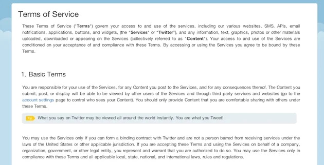
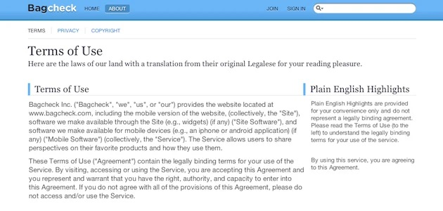
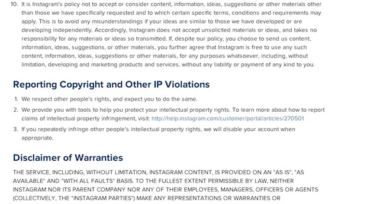

Originally published with [UX Magazine](https://uxmag.com/articles/terms-and-conditions-a-snapshot-of-confusion):

Like ghosts, [magnets](https://youtube.com/watch?v=_-agl0pOQfs), and the Force, terms and conditions influence us in mysterious ways. They tell us what we can and cannot do with a product or service, just not in a way that’s easily understood.

Recently, Instagram’s revised Terms of Service ignited outrage, quite a few account deletions and, in some extreme cases, reasonable discussion. What the revision did not do was provide clarity or set expectations.

Terms of service (or terms and conditions) are important and necessary, but they’re also largely inaccessible. Attorneys write them to protect the intellectual and material rights of their clients (the software vendors) and do so in the parlance of the legal system. In a court of law, these terms make sense. On a website intended to be read by non-lawyer humans [insert hacky “lawyers aren’t humans” joke here], these terms are gibberish.

Gibberish, as we all saw in the Instagram aftermath, tends to incite confusion: Do I own my photos? Is this picture of my half-eaten ham sandwich going to appear in an ad?

Maybe it’s time we think of terms of service as an extension of user experience. Yes, terms need to set legal parameters, but they should also set expectations, provide guidance, and serve the end user. For instance, Twitter displays a human-readable translation of their terms as “Tips” in tandem with the legalese. The translation doesn’t replace the actual terms, but it at least gives end users the gist of the agreement.

*Twitter's terms of service*

Bagcheck (also owned by Twitter) takes a similar tack by displaying the “Plain English Highlight” in a column next to the legalese in question.

*Bagcheck's terms of use*

Instagram’s current terms are not too onerous: 15 basic terms, six general conditions, and seven proprietary rights, all in semi-plain language. It’s not exactly conversational, but phrases like “You are responsible for any activity that occurs under your screen name” are pretty clear.

The UX/PR problem stems from Instagram’s proposed terms, where the terms—and the presentation of the terms—are more complex. What was presented in sentence case now appears in some combination of all caps, sentences, and numbered subsections. What once took 1,139 words now takes 5,149. A more robust agreement is one thing; a contract over half the length of Poor Richard’s Almanac is an undue burden.

*Instagram's terms of service*

The Instagram problem seems to be twofold: users were surprised by the changes, and unsure what the changes really mean. Both of these problems could have been mitigated with a bit of consideration.

To illustrate, let’s consider another recent update: Evernote recently launched a new version of its software. Not just new, but different: it marked a sea change in the UI. To prepare users for this change, the Evernote team followed two simple steps:

1. They showed what was coming beforehand to ease users into the changes.
2. They explained the effects of the changes.

It’s not exactly apples-to-apples: software updates are optional, and terms are (for now) compulsory. But Evernote’s considered approach to change demonstrates a path forward: *Perhaps we should think of terms of service updates as we would software updates.*

Apps like Evernote and iTunes set expectations by show-rooming their forthcoming changes, explaining what’s different, and giving users a chance to digest what’s in store. Show. Explain. Back off.

What did Instagram do? Announce. Foment outrage. Put up a quick “Ohnoes!” blog post.

What could they have done? Let’s translate the software update model:

**Describe** what’s changing. **Explain** why. **Illustrate** with real world examples. If Instagram had taken the time to translate what was in store (We’re cashing in and will need to use your photos to do so) and offered some real word examples of how this might effect users (All your ham sandwich photos [belong to us](https://en.wikipedia.org/wiki/All_your_base_are_belong_to_us)), the reaction might have still been severe, albeit less so.

It’s likely that Instagram’s forthcoming Terms of Service Revision 2: [Electric Boogaloo](https://.imdb.com/title/tt0086999/) will be just as inaccessible, but slightly less distasteful. It’s also likely that the furor will slowly dissipate as users decide that an un-photographed ham sandwich is less tasty than an artfully composed still life with sandwich.

You know what would be delightfully surprising? If Instagram begins speaking to its 100 million-plus users with consideration and respect, in terms they can understand.

---

[Read at UX Magazine](https://uxmag.com/articles/terms-and-conditions-a-snapshot-of-confusion).
