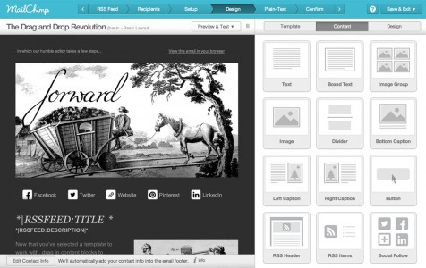
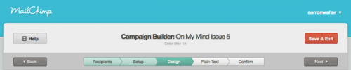
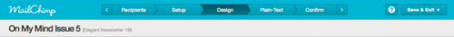
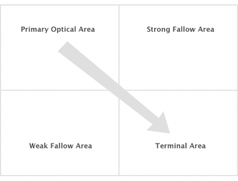
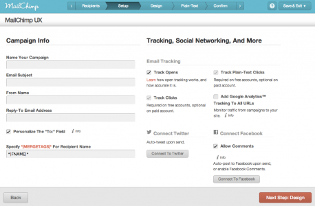
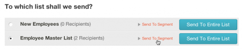
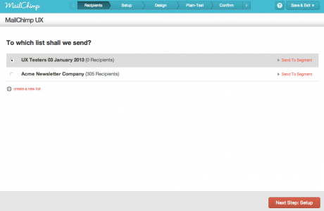

For the Mailchimp blog, I shared [our testing process for Mailchimp's new email campaign editor](https://web.archive.org/web/20131106185739/http://blog.mailchimp.com/here-are-32-seconds-make-the-most-of-em/):

Here at MailChimp, we’re realists—as much as we love email and all the [things you can do](https://web.archive.org/web/20131106185739/http%3A//inspiration.mailchimp.com/) with it, we understand that building a campaign is a task, not a life event. You want to get in, get done, and get on with things. Duly noted.

Our secret cadre of worker bees recently [unveiled](https://web.archive.org/web/20131106185739/http%3A//blog.mailchimp.com/introducing-mailchimps-new-editor/) our new drag-and-drop editor, codenamed Neapolitan.

We think it’s pretty neat, and we’ve heard from lots of customers that they’re building campaigns faster these days. But it got us thinking: what else could we do to make building a campaign faster and easier?

A few months ago, we [changed the navigation](https://web.archive.org/web/20131106185739/http%3A//blog.mailchimp.com/v7-5-new-mailchimp-features-going-live/) in our campaign builder from this:

To this:

We saved space, but we sacrificed the beloved **Next** and **Back** buttons. The Neapolitan team proposed a return of these buttons, but—spoiler alert!—placed them on the *bottom* of the page, in addition to keeping the existing navigation at top.

Crazy, right? Not really. Typically, when reading we follow the [Gutenberg Rule](https://web.archive.org/web/20131106185739/http%3A//51bits.com/articles/design-by-gutenberg/) (also known as the [Z-layout](https://web.archive.org/web/20131106185739/http%3A//webdesign.tutsplus.com/articles/design-theory/understanding-the-z-layout-in-web-design/)): left-to-right, top-to-bottom:

*Image via Smashing Magazine*

It’s a concept that originated in printed matter (you know, books and magazines), but it applies to the web.

### Getting testy

In our case, it seemed likely that MailChimp users would navigate to a page, perform a task, and *continue down the page* to a logical finishing point. However, we didn’t want to make changes based on instinct alone, so our crack research team went to work. We’re still beefing up our research methods and tools (someday we might set up an eye-tracking lab), but for now we roll lo-fi with videos and stopwatches.

### Phase 1

For the first part of our research, we recruited 10 Chimps (not real chimps, but rather MailChimp employees who weren’t privy to our design changes) to test our theory: 5 saw the old campaign builder, and 5 saw the new version that places additional navigation options at the bottom of the page:

We asked both sets of testers to follow the same scripted scenario: select a list, name the campaign, design a basic template, confirm the plain-text looks good, and then send a test campaign.

The results were beyond conclusive (or as conclusive as a 10-subject test can be). When presented with a choice of using the existing navigation at top or the new next and back buttons at the bottom of the page, 100% of our subjects (i.e., the 5 who saw the revised interface) used the new navigation.

That’s great, you might say, but what does that really mean to *me*, the reader of this blog and a [Julliard-trained dermatologist](https://web.archive.org/web/20131106185739/https%3A//www.google.com/url?sa=t&rct=j&q=&esrc=s&source=web&cd=1&cad=rja&sqi=2&ved=0CDkQtwIwAA&url=http://www.youtube.com/watch?v=5JGkMB2gFC0&ei=9RHrUIm_NYKi8QTik4DgAg&usg=AFQjCNHbkjr8i-SSK9RHUKyZbDGeihEwIA)?

Well, how about **32 seconds**? When we averaged the times for both groups, that’s how much quicker our testers completed their tasks using the new interface than those who saw the previous version.

For some fun with the numbers, we accounted for a few variables in tallying our results. For instance, designing an email campaign is a subjective task. Some users are *very* particular about what looks good, and they were not about to turn in something less than perfect.

To compensate, we ran the numbers without the design phase and found that the new interface came out, on average, **34 seconds** ahead of the previous version.

At this point we got a little cocky with our Excel skills:

Users who were reasonably savvy with MailChimp (not total newbies) finished their tasks, on average, **30 seconds** faster with the new interface, and **32 seconds** faster without the design phase.

It’s not quite rocket science, but we figure you’ve now got an extra hour of your life to live: If you send weekly, that’s 32 seconds per week, over 52 weeks, which is 27.73 minutes. Do this for two years and you’re just short of an hour in time saved, or one full episode of *Breaking Bad*. Did we blow your minds?

### Phase 2

Testing internally is helpful, but we wanted to introduce “real” MailChimp users to the changes to our interface. We [recruited](https://web.archive.org/web/20131106185739/http%3A//mailchimp.us1.list-manage.com/subscribe?u=5d5a7afb0736d06a206763b8e&id=a79456d97f) 7 users with varying degrees of MailChimp expertise to perform a set of tasks, which we moderated via [GoToMeeting](https://web.archive.org/web/20131106185739/http%3A//www.gotomeeting.com/fec/).

For this phase of testing, we focused on choosing recipients. Before, users would choose to send to an entire list by, well, clicking **Send To Entire List**.

With our shift to the navigation at the bottom of the page, we slightly changed the list-selection process. Now, a user simply clicks the list name and uses the new **Next** button to send to the entire list (or to a selected list segment).

When we presented this new interface to 7 users (and two completely-in-the-dark employees), we saw a couple of things:

First, most of our test subjects paused when introduced to the new design. The pauses ranged from lightning short to pretty short, to use scientifically accurate terminology.

Second, once the subjects oriented themselves with the new design, they proceeded without a hitch.

### Conclusion

Our takeaway was that the change to the recipient’s page is slightly noticeable, but not an impediment. Once our subjects processed the changes, they were able to get on with their task of making beautiful emails, *32 seconds faster*.

MailChimp: Like a time-creation machine mixed with an email-campaign maker backed up with lo-fi research. Stay tuned as MailChimp Research next tackles the intersection of autoresponders and food preparation.

---

[Read the entire post on the Mailchimp blog](https://web.archive.org/web/20131106185739/http://blog.mailchimp.com/here-are-32-seconds-make-the-most-of-em/).
