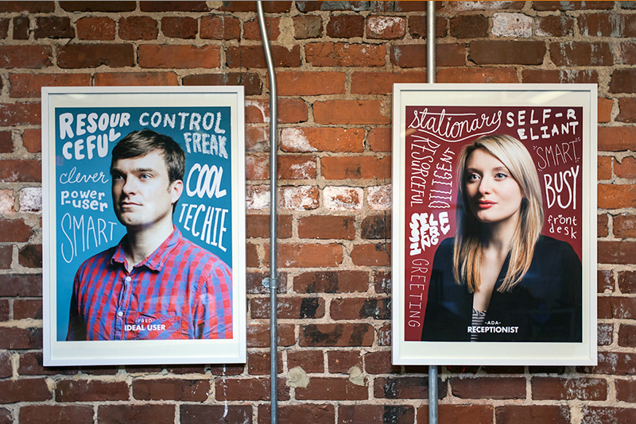
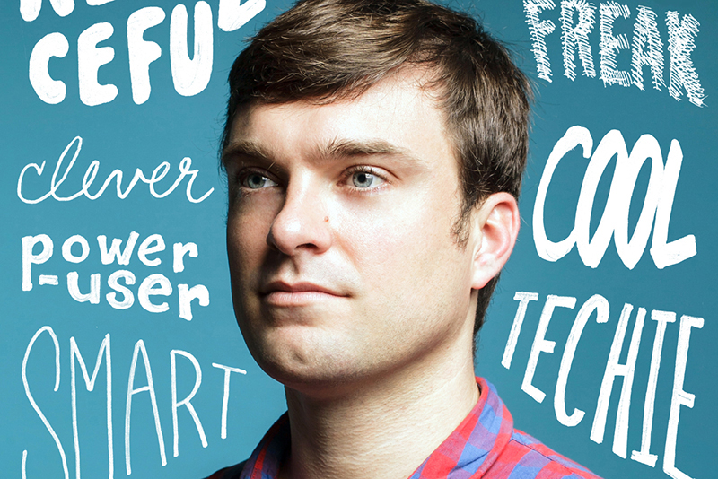
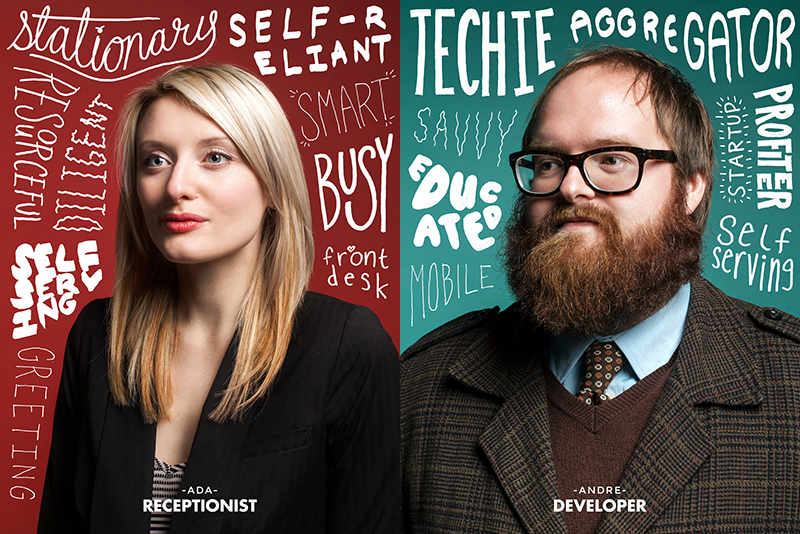

For the Mailchimp blog, I detailed how we [used personas to develop a clear understanding](https://web.archive.org/web/20131213011807/https://blog.mailchimp.com/new-mailchimp-user-persona-research/) of and empathy for our users as we redesigned the Mailchimp app:

A few weeks ago, MailChimp’s [DesignLab](https://web.archive.org/web/20131213011807/http%3A//designlab.mailchimp.com/persona-posters/) posted images of our User Personas to their blog. As Jason explained there, we wanted to find out who *really* uses MailChimp. It was a question posed to us by data analyst [Allison](https://web.archive.org/web/20131213011807/https%3A//twitter.com/allisonurban) last year. We could broadly generalize about our users (savvy, self-reliant, techie, motivated), but we realized that we couldn’t rattle off the four or five archetypical MailChimp users.

What we needed was a clear idea of our current users, so we could better empathize with them, and in turn design for and delight them—especially with a [massive redesign](https://web.archive.org/web/20131213011807/http%3A//blog.mailchimp.com/a-new-mailchimp-is-coming/) on the horizon. To reconcile who we *think* uses MailChimp with who *really* uses MailChimp, fellow researcher [Steph](https://web.archive.org/web/20131213011807/https%3A//twitter.com/sniffles) and I embarked on a long-term study of our customers to learn who they are; what, why, and how often they send; what kinds of issues they face; where they work; and what kind of people they are. This helps us understand how MailChimp fits into their day-to-day lives, which in turn empowers us to design smarter.

So, how’d we do it?

### Step 1: Interview MailChimp stakeholders to see who we assume our customers are

Our interviews with decision makers here at MailChimp were illuminating. When we asked, “Who do you think uses MailChimp?” nearly all of our subjects identified the same characteristics: smart, self-reliant, and techie. Steph and I decided to model an “ideal user,” Fred, after the aggregate data we collected from those interviews.

Fred is a great tool for a couple of reasons. First, he exposes our biases and assumptions. Second, he reminds us of the level of expertise we’d ideally like to see in our customers. He tells us to design MailChimp to empower our customers to communicate smartly and efficiently.

### Step 2: Rank our pool of active users by industry

We took a close look at the industries people selected when they signed up for MailChimp. Turns out, nonprofits, education, and the arts represent a *huge* number of MailChimp customers. This was helpful, because we thought specifically about them as we redesigned the app. We could start to contextualize where folks will be when they use MailChimp, and in what capacity.

### Step 3: Identify subjects from popular industries and interview, interview, interview

We took several of the top industries and started contacting users for in-person interviews. We met those customers at their workplaces—to present us with not only a human face, but a sense of the environment in which a MailChimp campaign is created. For instance, is the office quiet, or is there a lot of foot traffic? Is the computer a newer model or something outdated? What terms or phrases did our customers use to describe their work, their situations, and their emotional states? We ended up traveling to speak to customers in North America and Europe, focusing on Atlanta, Paris, London, and Madrid.

### Step 4: Analyze what we saw and heard

After we visited folks at their offices, we organized and tagged our findings, and then looked for patterns. We discovered a lot of similarities across different roles or types of customers. For example, we had initially thought of our advertising agency customers as much different from our communications consultant customers; we think of agencies as big groups with lots of moving parts, and consultants as independent operators. But both sets of users manage multiple campaigns for many clients simultaneously, and thus use MailChimp in similar capacities.

At the same time, both our public relations and administrative assistant customer groups described themselves as too busy to learn all of MailChimp’s features; they hardly have time in their days to set up and send a campaign—much less learn and implement new functions.

### Step 5: Share our findings with the team

When all was said and done, we ended up with five archetypical MailChimp personas: Fred, our “ideal” user based on our internal interviews; Andre, our developer persona; Eliza, our PR manager; Ada, the receptionist; and Mario, the studio consultant. These personas are meant to serve as guides as we design and develop MailChimp—who struggles with time and tasks? Who is quick to adopt advanced features?

We wanted to share these personas with the rest of the MailChimp crew in a way that’s easy to grasp at a glance. Our UX Director [Aarron](https://web.archive.org/web/20131213011807/https%3A//twitter.com/aarron) suggested we turn our personas into posters. Using tags from our interview analyses, [Justin](https://web.archive.org/web/20131213011807/http%3A//dribbble.com/shots/1085739-MailChimp-Persona-Project?list=users) and [Jason](https://web.archive.org/web/20131213011807/http%3A//www.jtrav.net/index.php?/work/photography/) from DesignLab went to work and created posters that now adorn the walls of MailChimp HQ. They’re hanging right by the espresso machine, where people from around the office congregate. Our hope is that the posters get employees talking about our users and their needs over a cup of coffee.

Some of the descriptions we used on the posters raised a few eyebrows around the office. “Isn’t ‘inefficient’ a criticism?” “What’s up with ‘profiteer?’” We strived for honesty in creating our descriptions. Profiteer is not a judgement—we have users who want to make buckets of money. How can we help? Likewise, inefficient is not a criticism—we have customers who need more hours in the day and acknowledge they could be working smarter. What can we do for them?

We realize that personas aren’t representative of all MailChimp customers; instead, we think of these personas as a snapshot in time of common users, knowing that their shelf-life is limited. In the short term, these personas were a big influence on our redesign process: we thought more about how teams collaborate and how individuals work in a [multi-screen world](https://web.archive.org/web/20131213011807/http%3A//www.google.com/think/research-studies/the-new-multi-screen-world-study.html). The personas also influenced our UX research team. Our five personas are a good start, but sometimes they could be the same person on different days, or there might be enough space to warrant additional, feature-specific personas to add a bit of nuance. They’ll help guide us as we consider new features and functionality for MailChimp users. Now, instead of wondering who really uses MailChimp, we can ask more pointedly, “Who would use this feature?”

