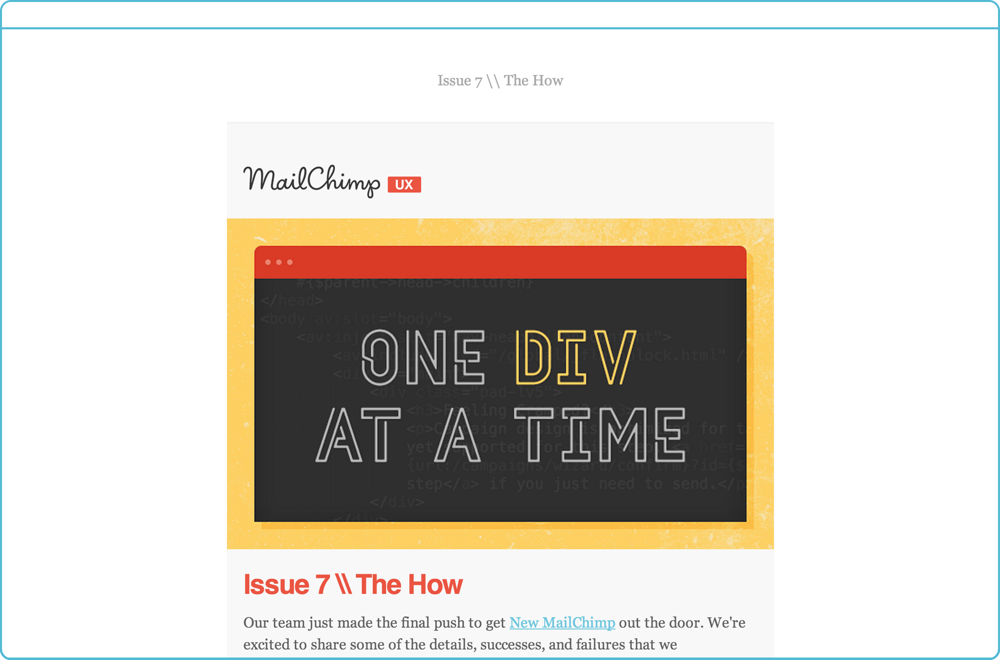
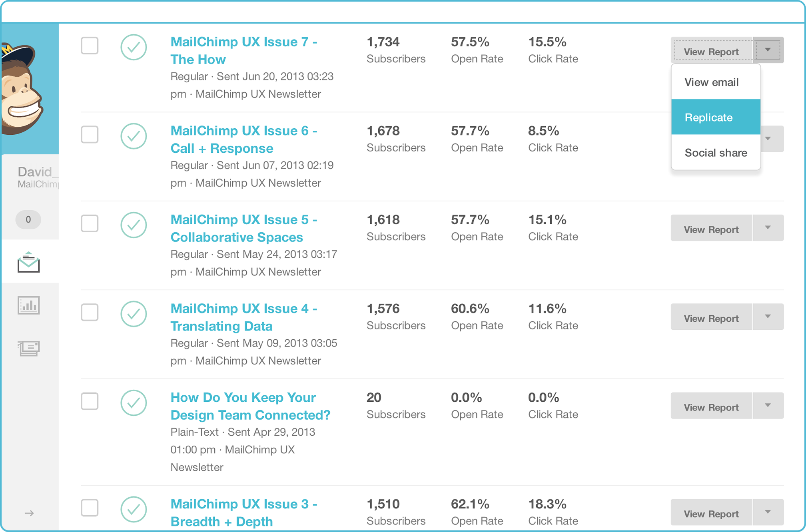
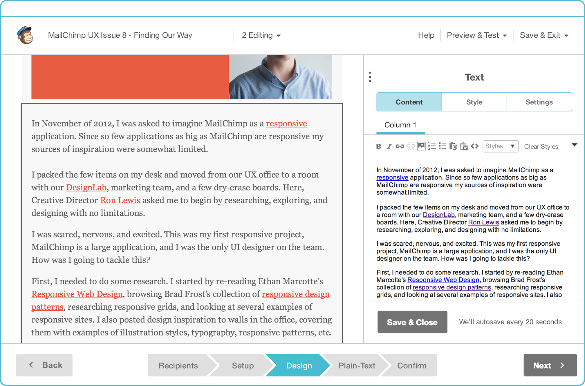
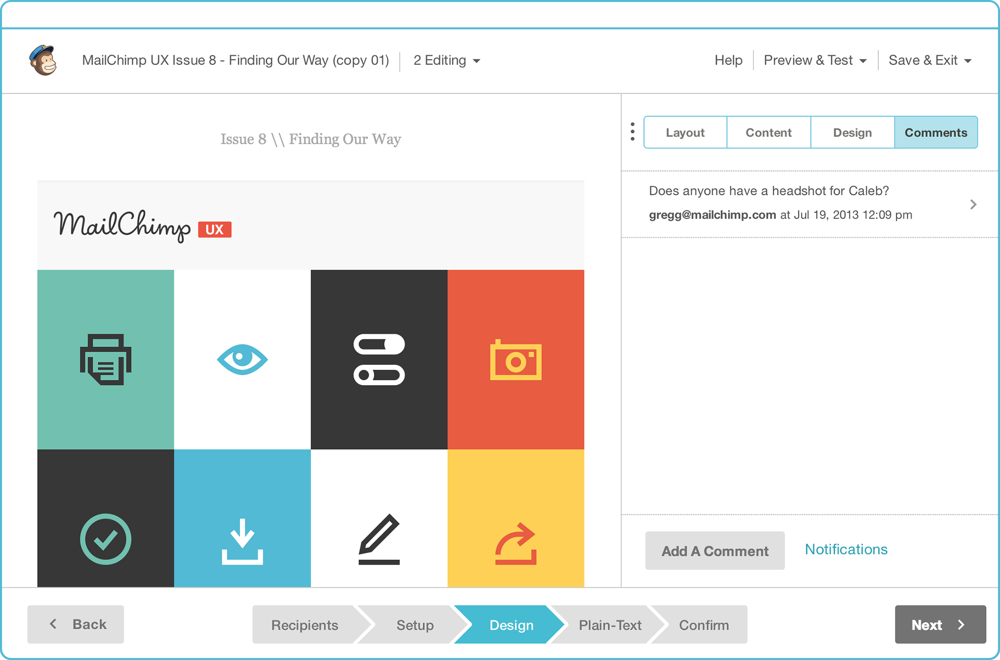
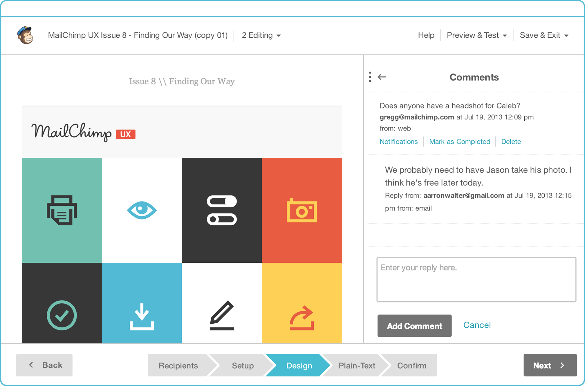
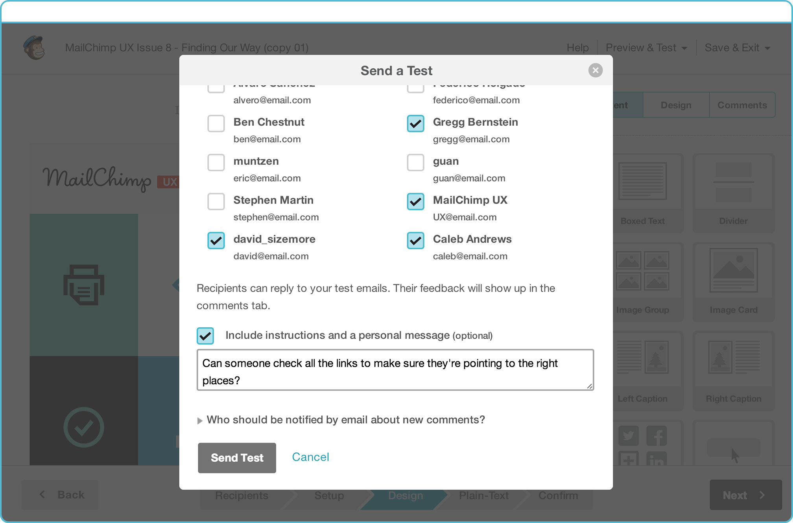
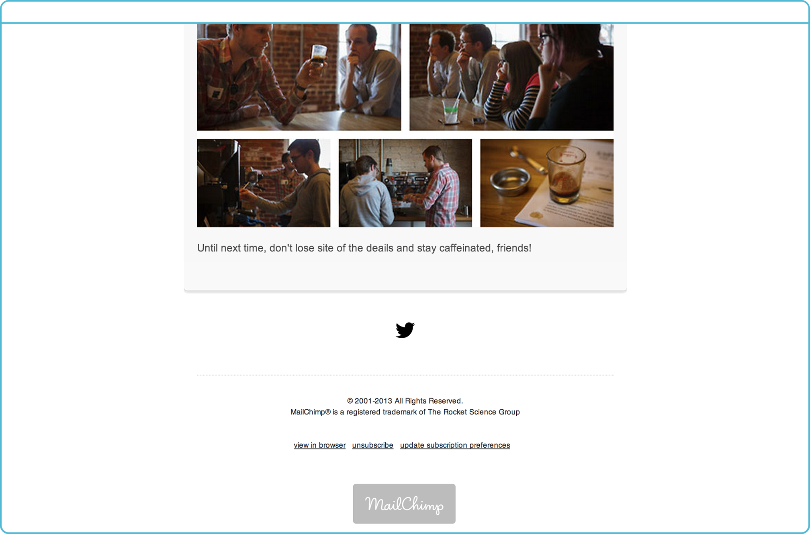

For the Mailchimp blog, I detailed [the workflow our UX team developed to ship our team's biweekly newsletter](https://web.archive.org/web/20131106020146/http://blog.mailchimp.com/how-we-collaborate-on-mailchimps-ux-newsletter/):

Earlier this year, UX Developer [Federico](https://web.archive.org/web/20131106020146/https%3A//twitter.com/fholgado) proposed we start a [UX newsletter](https://web.archive.org/web/20131106020146/http%3A//us5.campaign-archive2.com/?u=7e093c5cf4&id=24a4d1bbcc). The purpose of this newsletter would be twofold. First, we’d have an opportunity to share what goes on behind the scenes here at MailChimp. Second, we’d get the opportunity to regularly use our own app. It’s one thing to empathize with our customers—it’s entirely different to experience our app firsthand, just like our customers do.

Since Federico’s proposal, we’ve sent [9 editions of our newsletter](https://web.archive.org/web/20131106020146/http%3A//us5.campaign-archive2.com/home/?u=7e093c5cf4&id=ef8cc474cd "UX Newsletter Campaign Archive"). We’ve seen our list grow, tracked opens and clicks, and designated our subscriber VIPs. Fun stuff!

We’ve also settled into a workflow for the newsletter that takes advantage of our recently added [collaboration features](https://web.archive.org/web/20131106020146/http%3A//blog.mailchimp.com/new-collaboration-features-for-teams/). On a team of 12 folks, with occasional guest writers, there’s no shortage of participants or content. Having a way to allow multiple authors to add content at once, track changes, and resolve comments has been huge for us.

At the beginning of 2013, MailChimp added [multi-user accounts](https://web.archive.org/web/20131106020146/http%3A//blog.mailchimp.com/v8/). This allowed multiple individuals to have access to the same account, but with different permission levels. This was great in terms of controlling account access, but didn’t do much for collaboration—communication surrounding a campaign was relegated to external channels, like email and instant messaging. Not ideal.

With the inclusion of collaboration tools, we can now work on different content areas simultaneously, ask each other for feedback, and resolve issues along the way—all within the friendly confines of MailChimp. We thought this might be a good time to explain how we create our UX newsletter, and how we collaborate along the way. It might not look like the typical campaign creation process, but it works for us, and, as we’re starting to learn from research, it’s working for our customers too.

We send our newsletter every two weeks. Typically, we ask two of our team members to write content, and then whoever is available steps in to help with setup, styling, proofreading, and sending.

We have lots of ideas for our content, and these ideas live in Google Docs. Everyone on our team has access to this, and it’s a good place to list links worth sharing and story ideas. Once we’ve decided on content and authors, the fun begins.

We use the same design for every campaign, so we start by replicating the previous campaign.

Our authors log in individually, jump right into the new campaign’s design editor, and paste their respective stories.

We then flesh out the stories with relevant images. Some of the images, like author photos, are already stored within the [File Manager](https://web.archive.org/web/20131106020146/http%3A//blog.mailchimp.com/new-file-manager/). Others are uploaded from the individual authors, or by one of our designers.

Once the content is almost finished, the real collaboration begins—we add comments to the campaign. Sometimes the comment is a request for someone to edit a story. Other times, it’s a question about a specific paragraph or image. These comments are automatically emailed to everyone on our team. For those working within MailChimp, the comment simply appears in a tab next to the campaign. For everyone else, the comment also arrives via email.

For editorial or fact-checking questions, it’s pretty easy to reply to an email without having to log in to MailChimp. For instance, our UX team lead [Aarron](https://web.archive.org/web/20131106020146/https%3A//twitter.com/aarron) might be at a conference. He can simply reply to a question from his phone, and his feedback will appear for all to see within the app.

Comments often contain tasks for other team members. We can tick off comments as tasks are completed, which makes it easier to see when you’re ready to publish.

This process usually goes on for a good 30 minutes, as we divvy up proofreading and editing duties and add last-second content. Then it’s time to send a test campaign to our team, which works just like commenting. We send a test to the whole team, and folks can reply to the test with comments, which appear within the app. We also add notes to the test emails when we have specific questions about the campaign.

A couple of rounds of revisions and tests later, and we’re ready for our moment of glory. Hitting send on a campaign is a unique experience—there’s something about sharing your hard work with your subscribers that’s both stressful and exciting. It makes the job a bit easier when you know others have shared in the task to create the best campaign possible. Plus, when there’s a typo or grammatical issue, you can all share the blame!

---

[Read the entire post on the Mailchimp blog](https://web.archive.org/web/20131106020146/http://blog.mailchimp.com/how-we-collaborate-on-mailchimps-ux-newsletter/).
