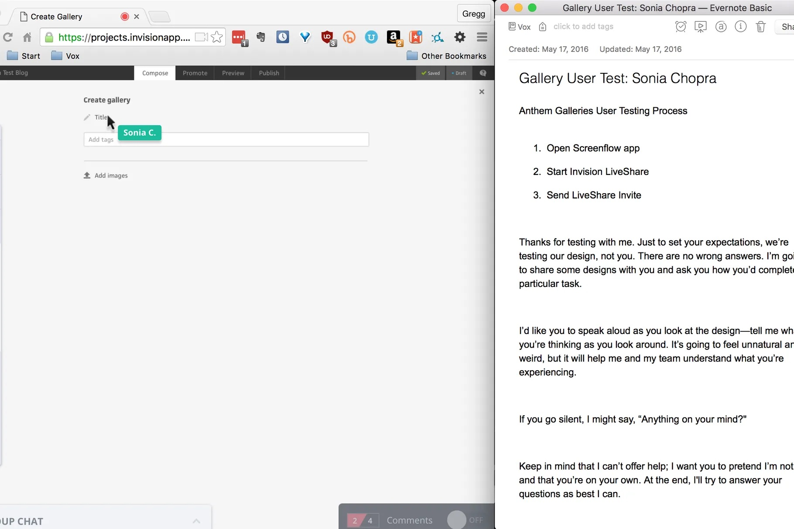
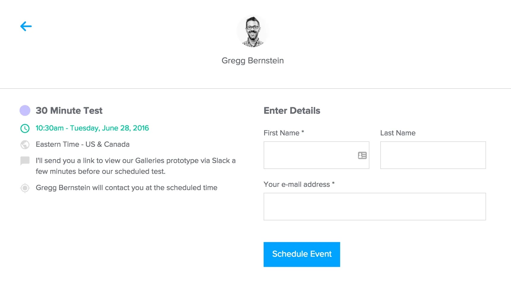
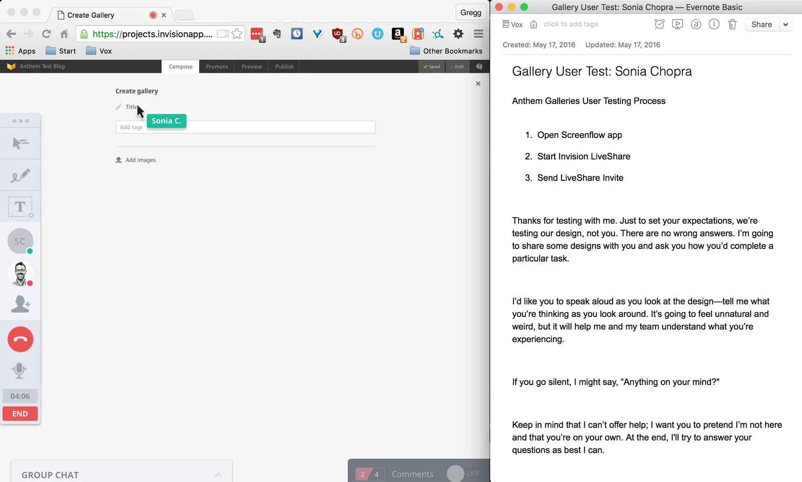
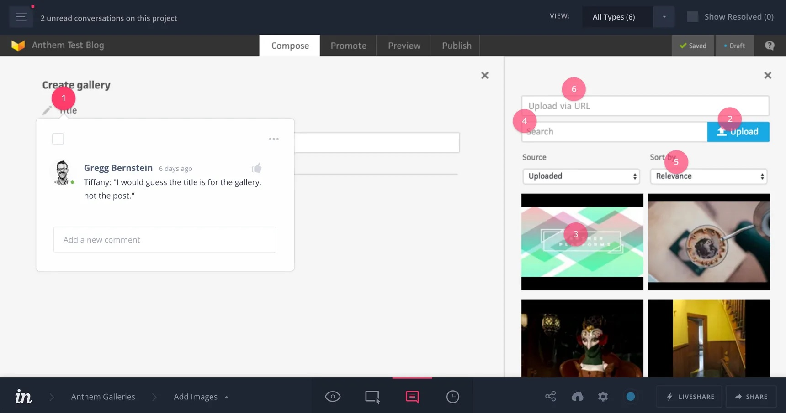

On the Vox Product blog, I walked through the low-friction, lightweight tools and methods we use for [usability testing at Vox Media](https://product.voxmedia.com/2016/5/26/11787530/remote-user-testing-at-vox):

*Remote user testing with InVision*

I recently joined Vox Media as Senior User Researcher, where I work remotely with a distributed team that relies heavily on asynchronous communication. As the sole researcher, my tasks run the research gamut—from interviews and user tests to providing guidance and sharing reports.

With everyone working in different places and with different computing environments, I needed to find some lightweight means to perform research with my colleagues—low friction, no time-consuming software installs, and no interruptions to routine. I wanted to align my methodology with the tools and behaviors endemic to my colleagues’ work habits (in and of itself a study of workplace culture!). Fortunately, a recent project provided an opportunity to test and refine a process for managing a series of usability tests. Here I’m going to walk through my steps for conducting user tests with my colleagues.

*The cost for this entire usability testing routine could amount to as little as $99—a small investment for a large amount of insight.*

*TL;DR: My toolkit is a combination of* [***Calendly***](https://calendly.com/) *(freemium) for scheduling,* [***Slack***](https://slack.com/) *(freemium) for communicating,* [***InVision***](https://www.invisionapp.com/) *(freemium) for testing and collaboration,* [***ScreenFlow***](https://www.telestream.net/screenflow/) *($99 after trial) for recording,* [***Evernote***](https://go.redirectingat.com?id=&xs=1&url=https%3A%2F%2Fevernote.com%2F&referrer=voxmedia.com&sref=https%3A%2F%2Fproduct.voxmedia.com%2F2016%2F5%2F26%2F11787530%2Fremote-user-testing-at-vox) *(freemium) for note taking, and* [***Google Apps***](https://apps.google.com/) *(freemium) for findable, archivable reports. Note that depending on the size of your organization and the scope of your project, the cost for this entire usability testing routine could amount to as little as $99—a small investment for a large amount of insight.*

*Scheduling with Calendly*

For scheduling, I use [Calendly](https://calendly.com/)—it integrates with my myriad Google calendars and allows my colleagues to grab a block of time with no emailing back and forth (and back and forth again). I share a Calendly link with potential test participants via our various [Slack](https://slack.com/) channels. Once someone selects a time, they receive an email confirmation with instructions that I'll contact them via Slack at our scheduled time.

The designers at Vox use InVision to share their work. Not wanting to add extra steps to the design process, I explored how I could work within InVision to test designs. My professional research network came to the rescue, as Academia’s [Kate Miltenberger](https://twitter.com/katemilty) and Intercom’s [Emma Meehan](https://twitter.com/emjmeehan) both pointed me to [InVision’s LiveShare](http://blog.invisionapp.com/introducing-invision-liveshare-real-time-design-meetings-in-your-browser/) feature, which allows multiple parties to view and manipulate the same wireframes or prototypes while also discussing them via voice chat. This meant that I could take the same files our designers create, generate a link, and invite my test participants to view and discuss them within InVision.

*InVision (l) and Evernote (r)*

At the scheduled test time, I set up like so:

* I split my screen with InVision in a browser window on the left, and my testing scenarios in an [Evernote](https://go.redirectingat.com?id=&xs=1&url=https%3A%2F%2Fevernote.com%2F&referrer=voxmedia.com&sref=https%3A%2F%2Fproduct.voxmedia.com%2F2016%2F5%2F26%2F11787530%2Fremote-user-testing-at-vox) doc on the right. I take notes in Evernote while testing, as it performs well even without wifi, and then syncs my notes to the cloud once I’m connected.
* I send the InVision LiveShare link to my test participant via Slack DM.
* Once they enter, I begin the built-in LiveShare voice chat.
* After salutations, I seek permission to record our session. I then start recording everything with [ScreenFlow](https://www.telestream.net/screenflow/).

One thing to note about ScreenFlow is that it records video as well as audio from both the computer *and* the microphone—something QuickTime (which comes with most Macs) can’t manage. This means that later on I can see the entire user test and hear all parties (myself included).

Once each test is complete, I end the LiveShare, stop and save the ScreenFlow recording, and save my notes. I then go back to ScreenFlow, set the playback to 150% speed, and watch and listen to the session while reading my notes, filling in any blanks and correcting inaccuracies along the way.

*Commenting within InVision*

After repeating this process for all of my interviews, I create a new Evernote doc with feedback categorized by each step in my test. In InVision, I **add this feedback as comments to the relevant portions of the design**. This allows my entire team to see testing feedback in context—every comment is pinned to the relevant portion of the design. I then share a link to the InVision comments with my team via Slack.

In addition to posting comments to InVision, I create a post-mortem [Google Doc](https://www.google.com/docs/about/) that includes a brief recap of the test, the methodology (task and scenario analysis, in this case), the takeaways, and the raw test transcripts. This too I share over Slack.

That’s my research-team-of-one usability testing process. I used a handful of free-to-inexpensive tools to manage a series of usability tests, all without requiring neither my participants nor my colleagues to download or register for any new tools.

---

[Read the entire post on the Vox Product blog](https://product.voxmedia.com/2016/5/26/11787530/remote-user-testing-at-vox).
