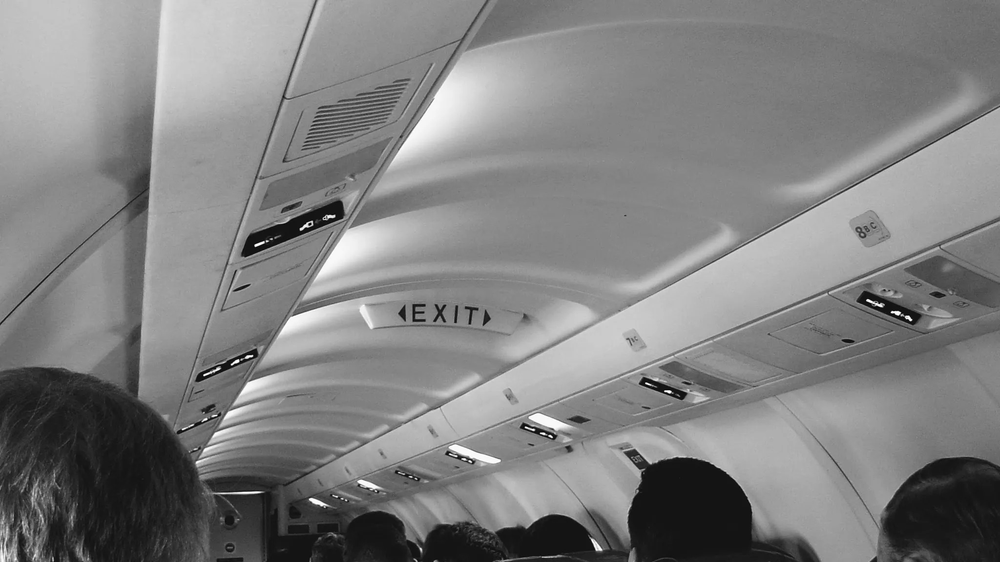

My friend [Jan Chipchase](http://www.studiodradiodurans.com/) is an authority on qualitative product research. He embeds himself in the field with a team of colleagues and fixers, capturing the context and ecosystems in which people live. He's the type of researcher I want to be when I grow up—traveling to the far corners of the earth to uncover hidden truths and potential opportunities.

Jan's taken his experiences and created the [Field Study Handbook](http://www.kickstarter.com/projects/janchipchase/the-field-study-handbook). It was a career highlight to work with Jan as a technical reviewer on a few chapters of the handbook, and I'm excited for the book's release in June, 2017.

As we get closer to the book's launch, I contributed a short piece about what you learn about a product research team in the field. Check out [The Field Test](https://medium.com/the-field-study-handbook/the-field-test-5a243e71ff35) on Medium, or read it below.

---

If you want to see your colleagues in a new light, escape the office.

The office is confining. We have our tasks, our schedules, our routines, our habits. We follow well-worn paths as we fulfill what’s expected of us in service to defined roles we agree to perform.

The field, though, is opportunity. Exiting the office and entering the field introduces novelty, variety, and a chance for adaptation. Team dynamics shift as colleagues demonstrate untapped skills in the face of unfamiliar environments and schedules.

In my experience managing a product research team, the field itself was never far-flung or exotic. We’re talking trips to the other side of the country, not the world. But being in the field with my team — on unfamiliar turf in faraway cities — provided a stress test from which unseen skills emerged.

One colleague revealed himself to be a connector. I knew he was a good networker, but he put his skills to great use in gathering likeminded folks along our travels. Our team made a point on every trip to meet other researchers and designers, who all shared tricks of the trade and favorite local meeting spots. These gatherings exposed us to new methods and approaches that made our work better. What’s more, we now had new allies we could call on for advice and recommendations.

Another colleague revealed a special talent for managing logistics; she carefully mitigated risk and placed colleagues in the best position to perform top work. From mapping local travel to creating dossiers on each study participant to finding appropriate locations for each meeting, this person revealed herself to be a future manager of people and resources. The field afforded this researcher an opportunity to look beyond findings and deliverables, and she provided a carefully planned expedition.

After being on the road for days, spent from being out of routine and exhausted from being “on” for too many consecutive hours, another colleague demonstrated stamina, walking out of each visit asking, “Did you see that?”; “Did you notice this?”; “Did you catch when he said that?” Nothing escaped this colleague’s attention, despite every excuse to let her guard down.

The work we did on the road paid off—our recounting of what we heard and saw influenced company strategy and product decisions. But the skills and talents that manifested in the field didn’t show up in any deliverable, and they’re not quite quantifiable. However, they set expectations for what field study requires. And they set a baseline of expectations for future hires and for the level of work performed in our organization.