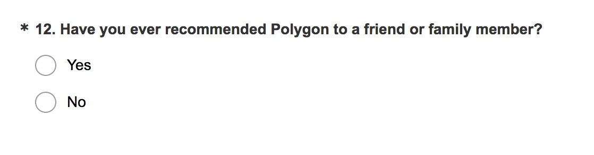
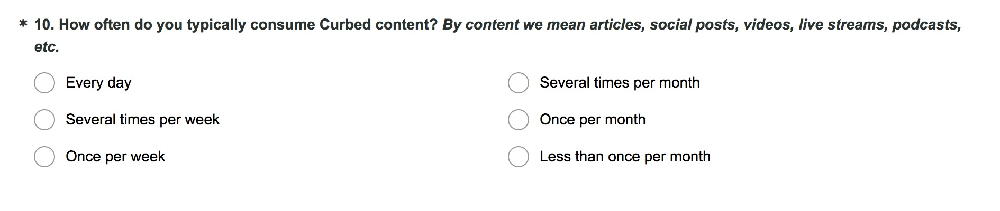

For _The Verge_, I wrote about Facebook's news trustworthiness survey. [Read the entire post on _The Verge_](https://www.theverge.com/2018/1/26/16933458/facebook-news-trust-survey-problems-editing) or below. 

I want to take a second to admit how surreal it is to open this update with "For _The Verge_." When I was finishing grad school, _The Verge_ launched. I knew immediately that it would become one of my favorite websites, and came very, very close to introducing myself via email to see what use they might have for a UX researcher or designer. That I ended up working with and contributing to _The Verge_ a few short years later is a career highlight.

---

The recent [disclosure of Facebook’s media trust survey](/2018/1/23/16925898/facebook-trust-survey-news-feed-media) caused a lot of hand-wringing about its brevity and format. 

I have no qualms about the length of the survey. The longer a survey takes to complete, the [less time participants spend per question and the higher the drop-off rate](https://www.surveymonkey.com/curiosity/survey_completion_times/). Less time spent per question leads to careless answers. Thus, a short survey is, ostensibly, a considered and completed survey. For their paean to minimalism, I salute the team behind this survey. However, the problem here isn’t that the survey is short. Rather, the two survey questions are phrased poorly.

The presentation of a survey belies its complexity. I’ve worked on a ridiculous number of consumer surveys over the years in my role as a user research lead. (Disclosure: I serve the Vox Product team in this capacity, where I work with folks from our teams and networks, *The Verge* included.) Drafting surveys is hard. You have to phrase questions in a way that makes your intentions clear to the widest possible audience in a manner in which they’ll offer answers instructive enough to inform business strategy decisions. The stakes are high!

There are a million ways to derail a survey, from using internal lingo (it might make sense to you, but not to anyone outside your office) to choosing the wrong answer format (a fill-in-the-blank field when a bank of answer choices would be easier for participants to complete) to offering answer choices that don’t provide meaningful information (as in, how does an 8 differ from a 7 on a measure of “How satisfied were you with your in-flight entertainment?”).

Where I take issue with Facebook’s survey is the construction of the survey questions:

**Do you recognize the following websites**
- Yes
- No

**How much do you trust each of these domains?**
- Entirely
- A lot
- Somewhat
- Barely
- Not at all

Let’s take this from the top. The first question hinges on recognition. Recognition is not the same as familiarity. I might recognize the guy at the mall as someone I also saw at the gym, but does that really mean anything? I still don’t know anything about this guy.

A better construction would anchor itself to a more meaningful interaction, like:

**Have you viewed content from the following websites?**

This is a much better question because it’s based on past behavior (“I have viewed content from this website!”), and it elevates the relationship between the participant and the content to something more significant (i.e., experience versus recognition).

I took this tack in a recent suite of surveys for the Vox Media networks. As part of an audience study, we wanted to gauge word-of-mouth recommendations for our networks. One proxy for word of mouth is the Net Promoter Score, which asks, “How likely are you to recommend Acme Widgets to a friend or family member?” This, however, isn’t grounded in past behavior, which makes it an unreliable measure. Instead, we asked:

This shifts the recommendation from hypothetical to factual. Had Facebook made this one semantic shift — from *recognizing websites* to *viewed content* — its survey would yield concrete and not fuzzy data.

Moving on, a survey should construct a story as it’s completed; each question should flow from one to the next. For this reason, consistency in language and concepts is paramount. The Facebook survey takes an odd turn from the first to second questions (no easy feat in such a short survey): it replaces *websites* with *domains*.

Granted, “domain” is a common enough term in web parlance. But among Facebook’s 2.07 billion monthly active users, I’d wager that the phrase “Check out this website!” is uttered with greater frequency than “Check out this domain!” It’s a change that does nothing but add an opportunity for a participant to question what’s being asked.

So let’s edit the question to:

**How much do you trust each of these websites?**

Sure, this construction elides granularity about specific writers or beats, and it conflates trusting a website with trusting *the validity of the content presented by* *the website*, but now it’s at least passable.

The answer choices are \*chef’s kiss emoji\* since the survey answers are phrased like humans speak. This makes it far easier for the participants to map their beliefs to the colloquial choices given. For a recent *Curbed* survey, we were curious how participants would describe their reading / watching habits. We knew people wouldn’t remember a specific frequency, so we asked in a vernacular that kept things accurate-ish:

Facebook’s short survey isn’t perfect by any stretch, but it’s accurate-ish. Instead of devoting some portion of their $300 billion war chest to yet more questions, I’d suggest they ring one of their media partners and ask to borrow an editor.
