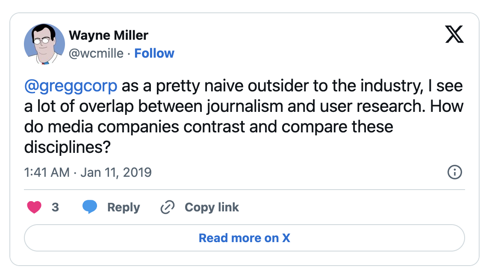
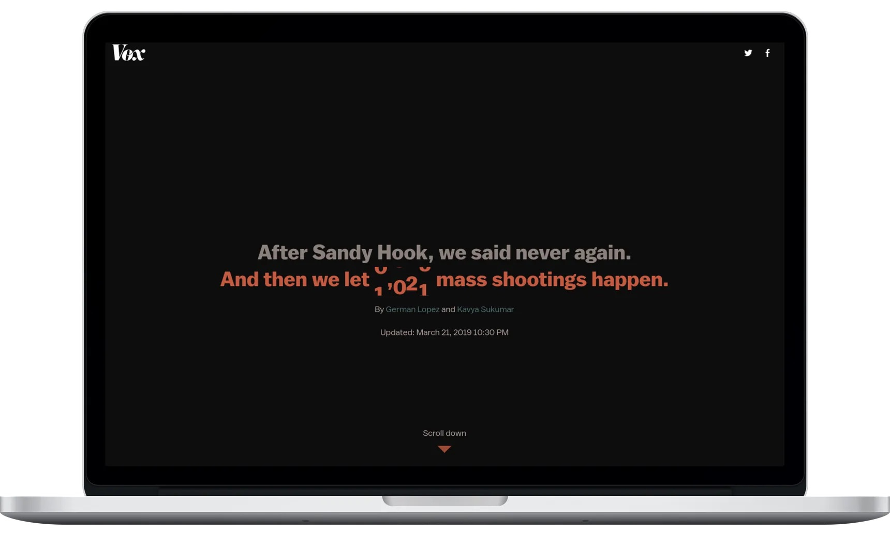

*[Victor Ware](https://www.twitter.com/nvrslps)/Vox Product*

On the Vox Product blog, I tackled the [journalism and user research relationship](https://product.voxmedia.com/2019/3/25/18240501/the-journalism-user-research-relationship), with an assist from Vox.com’s [Susannah Locke](https://twitter.com/susannahlocke):

Wayne Miller recently posed this question on Twitter: “As a pretty naive outsider to the industry, I see a lot of overlap between journalism and user research. How do media companies contrast and compare these disciplines?”

At Vox Media, the disciplines of journalism and user research serve different purposes, but are intertwined, collaborative, and share plenty of parallels. Broadly, Vox Media covers everything from public policy to pizzerias through the work of a large staff of journalists across seven networks: *Vox*, *The Verge*, *Polygon*, *Curbed*, *SB Nation*, *Recode*, and *Eater*. Vox Media also employs a handful of analysts and user researchers to help our editorial, leadership, sales, and product teams form strategies and shape coverage.

**Contrasting origins and goals**

Both disciplines share curatorial skills and editorial discretion, but with different origins and outcomes in mind. A journalist identifies (or is tipped about) a story worthy of the public interest, and then analyzes their findings with an eye toward educating, informing, or swaying public opinion. A journalist’s work is made evident to the public.

A user researcher advocates for change on behalf of customers, audience members, and users. A change might take shape as a new product, a redesigned experience, or an improved interaction. Of course, a crucial component of any user research project is to engage directly with users, often in an interview, survey, or usability test. However, because a typical user research project involves business strategy, revenue opportunities, product roadmaps, and user experience prototypes, the work of the user researcher isn’t necessarily shared with the public.

**Comparable methods**

Journalists and researchers share plenty of skills and tactics. When I shared Wayne’s question with [Susannah Locke](https://twitter.com/susannahlocke), *Vox’s* editor of special projects, she noted the similarities in our approaches to researching stories and experiences:

1. Find the right people
2. Set the stage and the expectations
3. Record things accurately
4. Shut up and listen
5. Don’t ask leading questions
6. Be curious and open minded
7. Ask follow-ups
8. Maintain the relationship
9. Analyze—and be fair in how you do so
10. Publish
11. Show them what you did, if you can! People love seeing what came out of their participation.

That final note is doubly crucial for user research. The more transparent the design and research process, the more inclusive it becomes. When customers or users see that they have an opportunity to influence something they care about or something that’s critical to their work, they become more invested in the experience. More, users understand that changes are made not arbitrarily, but thoughtfully with the participation of users.

**Collaboration**

At Vox Media, user researchers, journalists, and editorial leaders join forces to understand audiences at large. The perspectives and habits of all of our audiences—including readers, listeners, viewers, and subscribers—inform our editorial strategies and product decisions. Once that strategy manifests in a content idea, like a new newsletter, a user researcher will either survey, interview, or test with subscribers to gather feedback on the content and the context in which subscribers read the newsletter.

Similarly, journalists like Susannah will employ user research techniques, like user testing, to validate that a story’s structure or presentation is skimmable, navigable, and informative. Last year, Susannah and Vox editorial engineer [Kavya Sukumar](https://twitter.com/kavyaSukumar) developed a testing script and presented [this Vox.com story on mass shootings](https://www.vox.com/a/mass-shootings-america-sandy-hook-gun-violence) to a handful of readers to gather feedback, which resulted in changes to the story’s design.

*The opening text of a [Vox.com](http://Vox.com) story that was tested with audience members prior to publication.*

**One big happy**

To take this back to Wayne’s original question, while the roles differ, they inform one another and offer plenty of opportunities to collectively influence all facets of the storytelling and product experiences.

---

[Read the entire post on the Vox Product blog](https://product.voxmedia.com/2019/3/25/18240501/the-journalism-user-research-relationship).
