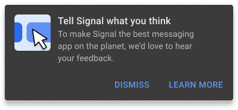

Over on the Signal blog, I wrote about how we're gingerly approaching UX research in the absence of data. [Read the entire post at Signal](https://signal.org/blog/signal-research/), or below:

Signal has always benefitted from our engaged and supportive community, and wouldn’t be what it is without your input and feedback. As the number of people using Signal has grown, so have our efforts to keep pace with what people expect from a messaging app, and where we might find new opportunities for Signal.

Software companies typically overflow with data that explains the past and forecasts possible futures. They know exactly who is doing what with their products, how often, and where. While an abundance of data can contribute to their product and user experience decisions, these data collection practices are often rife with overreach and abuse. Signal doesn’t track you, collect your data, or measure which features you use. Anything and everything you do with Signal is your business. Which means that for us to dial in the features and experiences you expect calls for a respectful practice of research.

## Our approach to research

The features you use, the way they work, and how they look are part of the Signal user experience [UX]. We conduct UX research to make sure that what we build works both as we intended and as you’d expect. Just this year we’ve worked with members of the Signal community, as well as people who have never before used Signal, to understand what we need to know about group calling—that is, audio or video calls between more than two people. At the start of this year that research consisted of interviews about group calling habits, while more recently we shared early designs with Signal users to see if we were on the right track.

While we practice standard UX research methods such as usability testing, interviews, observations, and surveys, we take a light touch in how we conduct our studies. Your privacy comes first, and you choose what and how you share with us. As much as we’d love to join a video call to learn more about how you use Signal, we know that’s not for everyone.

*An invitation to offer feedback to Signal*

This week, we’re rolling out our first global user experience survey to a small number of people via the Signal app. This survey will go a long way toward answering the fundamental question on the minds of everyone here: “Who uses Signal?” Knowing, in aggregate, who uses Signal, the various features you use (or don’t know about!), and how we can improve will make a better Signal for all.

We’re grateful for all the proactive bug reporting and feedback we already get, and through this survey we’re hoping to open the lines of communication to those who we might otherwise not hear from. This is a chance for us to hear from a broader pool of the community, and an opportunity to invite folks to speak further (on their terms) about their past Signal experiences or offer feedback on new features in the works.

## Looking ahead

In the coming months, we’ll use what we learn from this survey as a springboard for future studies, and we’re sure to have plenty more questions.
