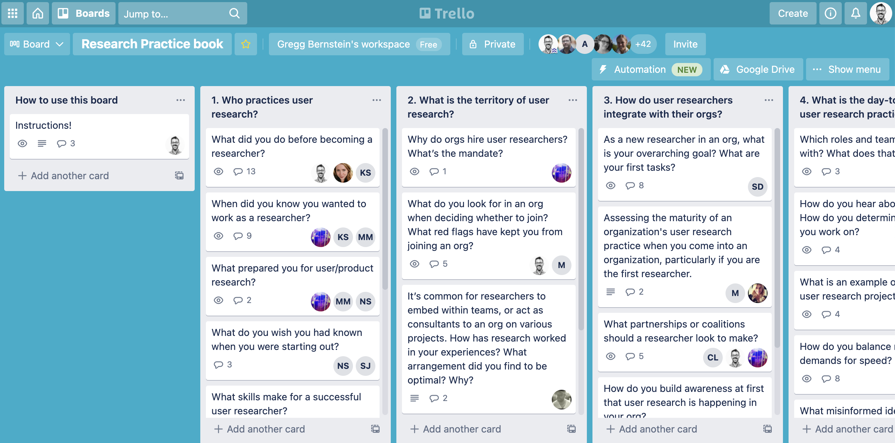
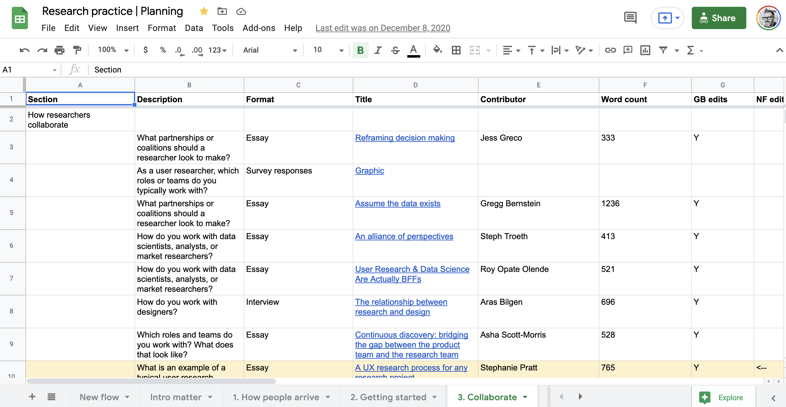
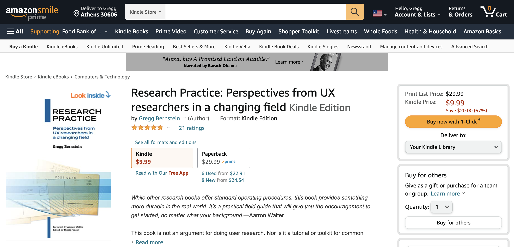

I launched my book *[Research Practice](http://researchpractice.co)* in January of this year. What I expected to write was a pithy translation of a conference talk I’d presented a few times about scaling research practices. Instead I wrote, published, and distributed a rather lengthy anthology of original essays and findings about how to enter and thrive in a user research role.

Here I’ll share how I self-published the book, with callouts (:bulb:) around the tooling choices I made.

If you’re pressed for time, here’s a tl;dr:
* Drafts: [Bear](https://bear.app/) notes app
* Professional development and polish: Invest in an editor
* Project organization: [Trello](http://trello.com/), Google Drive, and Google Sheets
* Forms and surveys: Google Forms and [Crowdsignal](https://crowdsignal.com/) (meh)
* Writing and editing: Google Docs
* Book layout for print and digital: [Vellum](https://vellum.pub/)
* Photo editing and cover layout: [Affinity Designer and Affinity Photo](https://affinity.serif.com/en-us/)
* Book printing and distribution: [Amazon KDP](https://kdp.amazon.com/en_US/) (print and digital) and [IngramSpark](https://www.ingramspark.com/) (print), with additional digital outlets detailed below
* Book mailing list: [Buttondown](https://buttondown.email/)
* Bookstore link management: [Geniuslink](https://geniuslink.com/)

## From spoken to written

*Gregg speaking at User Research London in 2017*

I created a new conference talk, “Be more certain,” for [User Research London 2017](https://www.userresearchlondon.com/2017/) about my practical approach to spinning up research practices. I soft-launched an early version of the talk at the [amUX](https://amux.org/) meetup in Atlanta first, where I received encouraging feedback and my first inkling that the subject matter resonated with audiences.

After I presented the talk in London and elsewhere, I knew that audiences found the content valuable. After each presentation, folks would come up to me after or email to ask for more details. And they weren’t just asking about my talk; non-researchers wanted to know how to get into this profession, and practicing researchers wanted more details about how to grow a team. There was clearly a gap—and opportunity—in user research literature for advice on getting into and scaling up user research.

My conference talk featured six sections. Add material about breaking into user research, bolt on an introduction and a conclusion, and you have the bones of a book outline. So that’s where I started. I took the speaker notes from my talk and elaborated so they could stand on their own.

---
*:bulb: I prefer the [Bear](https://bear.app/) notes app for rough drafts and user research interview notes. It’s like a very stripped down version of Evernote. I like that it supports markdown, and that it stores documents locally (making it highly responsive) but also syncs across Mac devices via iCloud (which means I can stub out a blog post idea on my phone and finish it when I get back to my laptop).*

---

## Hours of operation
I’ve worked in-house full time for the last decade. I generally work 10a to 6p Monday through Friday. Weekends are for me and my family. So when to work on a massive side project?

I love rising early to a quiet house, and decided to set writing hours from 5:30a to 6:40a each weekday. This gave me enough time to do what I needed each day: think deeply, write passages, review edits, or manage the book’s distribution.

---
*:bulb: Pro-tip: a programmable coffee maker is a great enticement to get out of bed. I would set my coffee to brew 5 minutes before my alarm went off, which meant the glorious and irresistible aroma of fresh coffee beckoned me to write each morning. Before I had a programmable [OXO](https://www.oxo.com/categories/coffee-tea/brew/coffee-makers/barista-brain-9-cup-coffee-maker.html) coffee maker, I used a [Moccamaster](https://www.williams-sonoma.com/products/technivorm-moccamaster-manual-coffee-maker-thermal-carafe/) that I plugged into a Wemo switch. You do you.*

---

I had a hard stop at 6:40a to wake my kids for school, so I always felt some urgency to accomplish something in my dedicated work block. Here’s the thing: I didn’t care if I actually *wrote* something during that block. If I was able to think clearly and untangle a thorny idea, that was progress. If I replied to a bunch of editorial suggestions, that was also progress. If I sent emails to contributors, that also counted as progress. I only wanted to use my special time wisely.

A benefit to using early morning time to write was that I didn’t have to sacrifice my morning runs (from 8ish to 9ish after I dropped my kids at school), nor did my project eat into evening time with my family.

## Professional-grade self-publishing
During my early morning sessions, I fleshed out the first half of the talk and felt like I was getting somewhere. But I needed help.

I knew I wanted to self-publish this book for a few reasons. Publishers offer a great deal of support to authors, such as content development, copy editing, production, distribution, and marketing. The benefit of this arrangement is that the author gets to focus almost exclusively on writing, but the tradeoff is giving up a greater percentage of sales revenue and—most important to me—a lack of control over the specific formatting of the book. I wanted to manage the entire publishing process from drafts to edits to production, and I also wanted the book to eschew prescriptive chapter conclusions or in-chapter activities, which are fairly standard among UX books.

However! I wanted the professional-grade quality that comes with a publishing house, which meant I would invest in hiring an editor to help with content development, copy editing, and formatting. Enter [Nicole Fenton](https://www.nicolefenton.com/), an author themself and a professional content strategist and editor.

With my semi-completed book in hand, I started working with Nicole, who slowed my roll and asked me to answer some important questions, like who specifically I was writing for and who else might find this book useful. After reading a Google Doc of my progress to that point, Nicole was also quick to question how my perspective would apply to industries I hadn’t worked in (like civic tech or health) or enterprise-sized organizations.

## From solo to chorus
To broaden the usefulness of the book, I created a discussion guide about scaling UX research practices and began to interview researchers with experience in different industries and at different organizational sizes. These calls were productive, but on one of these calls, researcher [Sian Townsend](https://www.linkedin.com/in/siantownsend/) suggested I follow the model [Intercom](https://www.intercom.com/resources?on_pageview_event=books_guides_footer), her former employer, used for publishing: ask experts to write their own contributions.

This made a whole lot of sense. If my goal was to include perspectives beyond my own, I needed to remove myself as a filter and instead let others tell their stories. My book would no longer be my useful yet limited advice, but rather a variety of perspectives on different stages of a career in user research.

I converted my discussion guide into a Trello board of broad categories and specific topics I thought the book should cover. I sent the Trello board link to a group of research professionals I knew, and asked folks to sign up to write about the topics they felt comfortable tackling. I also encouraged folks to share the Trello board with others in their networks (snowball recruiting for the win).

---
*:bulb: [Trello](http://trello.com/) rules for project management. The ease of creating and assigning task cards and taking in the entire scope of a project in a kanban view can’t be beat. It’s also super easy to add someone to a Trello board and have them grok what’s going on, which is a pretty crucial aspect of project management software that competitive products (hi, Jira!) needlessly complexify.*

---

## Learning project management the hard way

*The Research Practice Trello board*

Since I was shifting from authoring my own book to publishing the words of myself and others, I needed to step things up on the organizational front and manage the holistic details of the book project. I created a book release agreement to secure permission from the book’s participants to publish and promote their respective contributions.

---
*:bulb: For the book release agreement, I set up a very simple Google Form that displayed the release text and asked contributors to answer whether they agree to the terms. For those who required permission from an employer, I also included a link to a pdf of the agreement that could be shared with a manager or legal team. For straightforward agreements or dead simple surveys, Google Forms is a perfectly acceptable product.*

---

I also needed to collect details from each participant. Some of the details would inform the book’s content, like educational background, job title, job reporting structure, and research experience. Some details were more practical, like contact and shipping information (for sending a copy of the book), preferred pronouns, and their biographies as they’d like them to appear in the book.

---
*:bulb: For the participant survey, I experimented with [Crowdsignal](https://crowdsignal.com/), a survey tool from the folks at Automattic. I love surveys (and enjoy building them), but I did not love Crowdsignal, mainly because the survey editor makes it too hard to see the overall survey flow by limiting your view to one page at a time. What's more, the results UI is pretty limited, and any analysis requires upgrading to a paid plan, as does exporting data to analyze in a separate tool like Excel. In hindsight, I would have created another Google Form for the participant survey.*

---

I used Google Drive as my source of truth for contributor essays. I created a folder for each section of the book. Once contributors signed up for topics on Trello, I shared a unique Google Doc with them on the Trello board that was already filed in the proper Drive folder.

The doc header listed the name of the section, the topic the contributor volunteered to write, and their name. By controlling the creation and location of docs, I was able to maintain order across over a hundred unique docs.

---
*:bulb: The hierarchical structure and permissions of Google Drive and the collaborative features of Google Docs (commenting, suggestions, multitenancy) made the publishing process much easier than it could have been. Zero complaints.*

---

To track each participant’s progress, participation release status, survey completion, and biographical details, I created a big spreadsheet with some basic conditional formatting: anything incomplete remained red until I marked it as done, at which point it switched to calming green.

## Filling the gaps

*The Research Practice planning spreadsheet*

Once all the contributors turned in their submissions, I created a spreadsheet to map out the flow of the book. By viewing the entire map at once, Nicole and I were able to sequence (and re-sequence) the contents of each chapter as well as the chapters as a whole.  

---
*:bulb: As much as I love tools like Miro and Mural, I still work most efficiently in Google Sheets for grouping/organizational tasks.*

---

We were also able to spot the gaps in the book’s content. To mitigate these gaps, I fielded yet another Crowdsignal survey (I hadn’t learned my lesson yet) that I shared with the broader UX research community via social media, Slack groups, and listservs. This survey asked a handful of short-answer questions about how practitioners ended up in UX research, what the UX research career ladder is, what roles UX researchers work with, and more.

Additionally, some potential contributors, due to time constraints, preferred to sit for an interview about a specific topic. I scheduled these calls for either my lunch hour or at the end of my work day. For these interviews, I recorded our Zoom call, sent the recording to [Temi](temi.com) for transcription, edited the conversation for clarity, and confirmed with the contributor that nothing was amiss.

---
*:bulb: Temi is an automated audio-to-text transcription service. I find it exponentially more accurate than Zoom’s native transcriptions, but that increase in quality comes at a price (i.e., it’s not free).*

---

## The shape of a book
With the content complete and the sequence locked in, Nicole and I began the process of creating a cohesive publication. I created a new Google doc with all the sequenced content and added analysis of my UX research community survey and chapter introductions.

Together we made suggestions and edits, added transitions, clarified the muddled phrases, and got to a stopping point. I sent the first three chapters to a couple of peers who had agreed to be early readers. Once they provided (brutally honest) feedback about the flow, Nicole and I took a few more cracks at the content. I then added the introduction, conclusion, biographies, etc.

## Divide and conquer

*Setting things up in Vellum*

At this point Nicole and I worked on parallel tracks: I started to set up the book for production, while they copyedited the content. Reader, don’t skimp on copyediting. I think of myself as a careful writer, but Nicole found so many things I had overlooked: easily-missed typos, misuse of words, subject-verb disagreement, run-on sentences, and so on. This is where an editor elevates a self-published book from passable to professional.

As Nicole finished proofing sections of the book, I imported them into the [Vellum](https://vellum.pub/) app. In Vellum I was able to add the “big parts and smaller chapters” structure I wanted, place images and captions, build out a table of contents, and preview how the book would look both in print and on various e-readers.

---
*:bulb: What I like about Vellum is that it allows you to set up a book once and export it for print and digital publication. You can select the print parameters you want (6x9, square, whatever) and your digital destinations (Amazon, Apple, Kobo), and Vellum gets it right. You can tell Vellum was built for the professional self-publisher and that they listen to user feedback.*

---

As Nicole and I got to the end and I could see the book as a whole, I tackled the book’s introduction and added Aarron Walter’s foreword.

I also wanted to include an author photo (and knew I’d need pics of myself for promotions). This was in the midst of the pandemic, pre-vaccines, so I had to scrap my plan to hire a professional photographer. Instead I bought a [remote shutter](https://smile.amazon.com/gp/product/B0113W6A84/ref=ppx_yo_dt_b_asin_title_o04_s01?ie=UTF8&psc=1) for my iPhone, a [tripod phone mount](https://smile.amazon.com/gp/product/B06XYBTH7G/ref=ppx_yo_dt_b_asin_title_o04_s00?ie=UTF8&psc=1), and a [LED light](https://smile.amazon.com/gp/product/B07YSF3X8K/ref=ppx_yo_dt_b_asin_title_o04_s00?ie=UTF8&psc=1) to shoot my own images.

*Self portrait using items purchased from Amazon*

Though Vellum simplifies book layout and publishing, it doesn't create book jackets or Kindle covers. For that I used [Affinity Photo and Affinity Designer](https://affinity.serif.com/en-us/). I also used Affinity Photo to modify some of the interior images and my author photos.

---
*:bulb: Having spent the first part of my career living in Adobe Photoshop and Illustrator, I wasn't sure about using an entirely new suite of layout products. My fears were unfounded; Affinity's tools are fast, powerful, intuitive, and—best of all—affordable.*

---

With all of this done, it was time to ship the book.

## Actually self-publishing

*Research Practice on Amazon*

Self-publishing authors have a number of paths to take. While folks like [Brad Frost](https://bradfrost.com/blog/post/self-publishing-a-book-for-fun-and-profit/) and [Jan Chipchase](https://medium.com/@janchip/the-anatomy-of-a-kickstarter-d23406a08c66) managed the printing and distribution of their books, I followed the examples of [Abby Covert](http://abbytheia.com/2014/11/06/how-i-made-sense-of-my-mess/) and [Cyd Harrell](https://cydharrell.com/book/) and offloaded these processes to service providers.

First, I purchased my ISBNs (unique book identifiers) for the print and digital editions of my book from [Bowker](https://www.myidentifiers.com/). While some platforms will assign you an identifier if you publish with them, that identifier is unique to the assigning platform and is often not recognized by other platforms. It can also lock you into exclusivity with a single platform, limiting your distribution options. By purchasing my own ISBN, I ensured that my book could be printed and distributed everywhere.

I used [Amazon’s KDP](https://kdp.amazon.com/en_US/) (Kindle Direct Publishing) program as the primary source for both the paperback and Kindle versions of *Research Practice*. Amazon is ubiquitous, and while I disagree with many of their business practices, they eliminate the barrier to both publishing and purchasing a book. For KDP authors, Amazon makes it very easy to order promotional and author copies, to advertise the book in their search results, and to make the book available in their international storefronts. I also opted to offer the digital edition exclusively via Amazon for the first 90 days after launch in exchange for a greater percentage of sales.

I also used [IngramSpark](https://www.ingramspark.com/) for wider print distribution. While Amazon offers global distribution, most non-Amazon retailers (independent bookstores) and distributors won’t offer Amazon publications. Offering the paperback book through IngramSpark (in addition to Amazon) meant that any bookstore in the world could order *Research Practice*.

Once my 90-day exclusivity window for the Kindle edition expired with Amazon, I also distributed the book via [Kobo](https://www.kobo.com/us/en/p/writinglife), [Draft2Digital](https://draft2digital.com/), and [StreetLib](https://www.streetlib.com/). These digital distributors ensured my epub was available from Apple, Google Play, Barnes & Noble, and many international platforms.

With my book available in multiple shops, I wanted to be able to share a single URL that would get people to the right place. I bought the URL researchpractice.co from [iwantmyname](https://iwantmyname.com/) and redirected it to my [Geniuslink](https://geniuslink.com/) page.

---
*:bulb: Geniuslink is a service that detects your location and device and links you to the right store—so if you’re in the United Kingdom, you’re linked to Amazon.co.uk.*

---

I also added a link to [IndieBound](https://www.indiebound.org/), which allows you to find independent bookstores from which you can order *Research Practice*.

## Launch
I’ve had a mailing list for ages, and used it to share samples of the book prior to launch. Once the book was available, I shared the researchpractice.co link. I also posted the samples to my [website](https://gregg.io/book) and [LinkedIn](https://www.linkedin.com/in/greggbernstein/). On my site I created a new Book section with background on the book, excerpts, the table of contents, and the full list of contributors.

---
*:bulb: [Buttondown](https://buttondown.email/) suits my needs for easy, sporadic emails. Mailchimp is a bit more product than I need, and Substack is usable enough but I disagree with their (lack of) editorial or content policies. So far, so good with Buttondown.*

---

## Looking back
I gave the first version of the talk that became this book in February of 2017. I launched the book in January of 2021. That makes about four years that this project was rattling around my head.

When I think about what I would have done differently, I could have marketed the book more via blog posts and podcast appearances. But then again, I burned out: launch day took place in the midst of a pandemic, just after a failed coup, one week after I left a job over ethical concerns, and one week before I started a different job that proved highly dissatisfying. All of this is to say that I didn’t market the book as actively as I planned, but the last 18 months have proven that none of our plans really mean anything anymore.

It took me some trial and error to get the book available via IngramSpark and Google Play, which was frustrating but also part of the experience of learning how to publish. I don’t think I could have understood what I was doing without encountering that friction.

Overall, I invested a ton of time, energy, and money into the book I felt this field needed—the book I wish I had when I started as a researcher. To see it out in the world is immensely satisfying, and I would do it again in a heartbeat.
