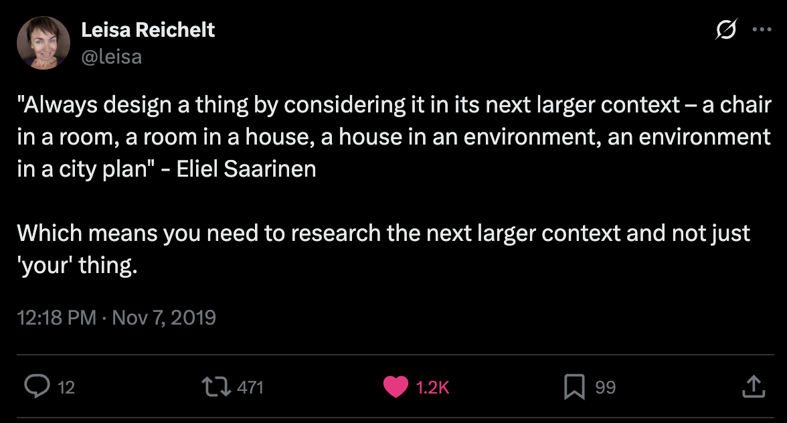

*The following post was originally the conclusion to Research Practice, but it didn't make the final cut. However, I’ve edited it to stand on its own as a blog post.*

---

Ian Mackaye is best known for his seminal bands Minor Threat and Fugazi, and for starting the independent record company, [Dischord Records](https://www.dischord.com/band/ian-mackaye). In light of his accomplishments as a musician and label owner, Mackaye was asked in a [Huck Magazine interview](https://www.huckmag.com/art-and-culture/music-2/ian-mackaye-survival-issue-interview/), “When you look back on your own history, do you compartmentalise it into different eras?” He responded: “I’m definitively anti-chapter. It’s all a flight of stairs. I wouldn’t be where I am now if it weren’t for the steps before.”

>It’s all a flight of stairs. I wouldn’t be where I am now if it weren’t for the steps before.
>
> <cite>Ian Mackaye</cite>

**It’s all a flight of stairs.** I opened my book *Research Practice* by recalling that I stumbled into user research, and I shared further struggles—my own, and those of others—throughout the book. We all stumble and struggle as we take our steps, and that’s okay. Our superpower as researchers is our ability to make sense of things—to form connections between disparate data points, reconcile contradictory findings, and learn from our missteps just as we learn from our successes.

<iframe src="https://www.youtube.com/embed/rhpB8sgEboU" frameborder="0" allowfullscreen></iframe>

At the Strive UX research conference in 2018, [Matt Gallivan](https://twitter.com/mgallivan) shared that “Researchers have outward-facing knowledge of people’s behaviors and needs, and the expertise to generate it. No other discipline does.” Gallivan was discussing the opportunity for researchers to lead design, product management, data science, content strategy, and engineering teams. I agree with Gallivan, but I think that’s just the start as I see our portfolios now growing to encompass market research, statistical analysis, and behavioral economics. The future of this field is wide open, and the practices in place today will be unrecognizable in a few short years.

Our evolving skills and responsibilities position us to guide larger decisions, shape broader strategies, and lead not just other teams but eventually entire organizations. We’ll stumble along the way, but we’ll continue to step forward.

Think about the steps you can take to enact change in your studies, your peers, your organization, and our field. Research leader [Leisa Reichelt](https://twitter.com/leisa) shared the following on Twitter in 2019:

Reichelt’s advice applies to research *practice* as much as it does research *projects*. Search for not only the better stories about the people we study but the better approaches to and larger meanings of our work.

Create the research practice that works for you, and be ready to evolve your approach after every step. It’s all a flight of stairs.
