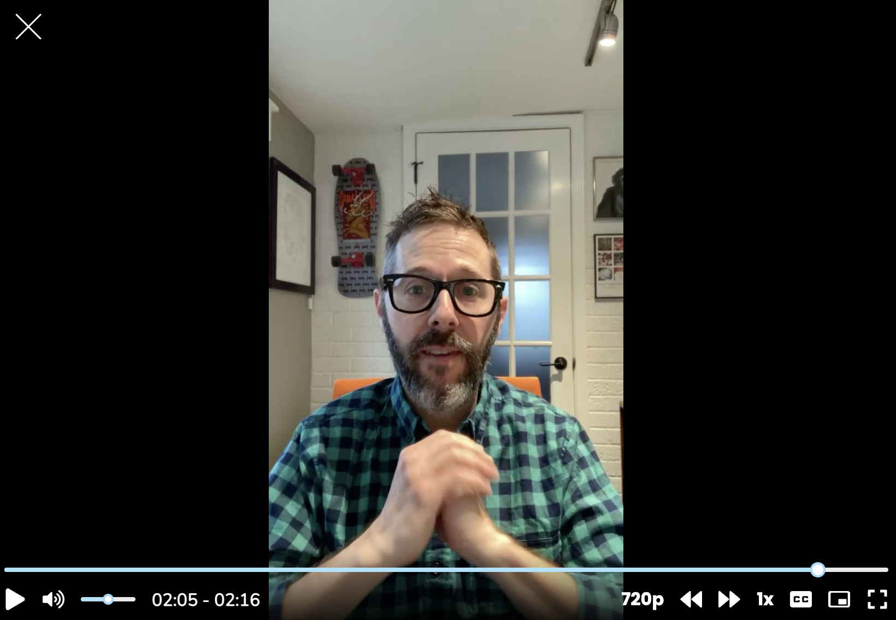

For the Learners community, I tackled the question, “How do you grow a research team at a company that has never had one?”

*Me talking about growing teams (screenshot only)*

That question presupposes that a team is the right way to grow research. I say that because headcount is always the easy answer to building a new function, but a good research leader—a good leader, period—needs to know all the levers to pull before landing on headcount. We saw the repercussions of rapid scaling play out in recent layoffs across the tech sector, so instead let’s focus on avenues to explore before opening a role.

Before growing a team, focus on growing your research capabilities and your remit. What are the things you as a team of one can do now through your work, your findings, or your partnerships with others in the org? 

Maybe it’s democratizing tools and datasets that others didn’t know about to support critical decisions. What if it turns out your org needs better management of existing assets and not a human?

Maybe it’s creating playbooks and templates folks can follow to talk to users themselves. What if it turns out everyone is perfectly capable of conducting [Just Enough Research](https://abookapart.com/products/just-enough-research) and your role is to create infrastructure and uphold best practices?

Maybe it’s meeting with leaders around your org to understand what information would help them make better decisions. Now we’re getting somewhere. What if it turns out the questions aren’t so numerous that you can’t address them yourself?

Now, after you’ve done all you can as a team of one to set everyone up for success, take stock of what gaps remain. Identify where the consistent demand for research is coming from and that should tell you how to scale through headcount.

But! Even then, hiring doesn’t necessarily mean committing to a full time hire. Do you need a researcher to embed with a specific team doing high priority work? Test the waters by hiring a contractor to see if having another body is the right approach.

You might even discover that you have all things research covered, but you lack the time to invest in recruiting, panel management, scheduling, and compensation. Congrats, now you know you need to hire a research operations specialist.

Once you exhaust all other possibilities and identify the human-shaped hole in your research function, you can make a clear business case for hiring. Not only that, you can set your eventual hire up for success by articulating to them **exactly how they will help your organization**.

Growing a team is amazing, to be sure! But the real work is everything that happens before you add headcount. 