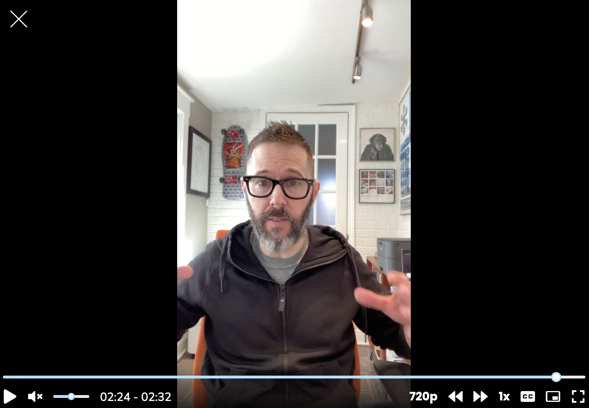

For Learners, I answered the question, “As a journalist, how do I leverage my background to break into user research?”


*Me talking about journalism (screenshot only)*


I’ve worked in media with journalists pretty steadily since 2016, and there is a lot of overlap between journalism and user research. It’s a topic I’ve covered before on the [Vox Product blog](https://product.voxmedia.com/2019/3/25/18240501/the-journalism-user-research-relationship), but here I’ll answer it with an eye toward *getting a job*.

Journalists identify stories worthy of the public interest. They conduct desk research and identify the right folks with whom to conduct primary research. And they analyze their findings with an eye toward educating, informing, or swaying public opinion.

User researchers, instead of working in the general public’s interest, advocate for change on behalf of their users and toward the goals of their organizations. And though the exact methods differ, the mindset is similar: be curious, do your homework, talk to the right people, analyze what you’ve learned, and present it back.

And that takes us back to the question at hand: **how do I leverage my background to break into user research?** My advice is to explicitly call out the similar approaches between journalism and user research in any cover letters or resumés you send out, and any job interviews you go on.

That extends to a portfolio, too. Revisit your publishing experience and see if you can present that same work as a user researcher would. Here’s what that might look like:

```
For this story, the question I was trying to answer was ____.
My methods for answering that question were ____.
For my secondary or desk research, I looked at ____.
The people I interviewed for this story were ____.
From my collected data, I concluded ____.
After my story was published, ____ happened.
If I had to do it over again, I would have changed ____.
```
<br/>
That sounds like a user research project to me!

The curiosity inherent to journalism will get you most of the way there; put some time into making the similarities as clear as day to any hiring manager and you should be well-positioned to break into this field.

Good luck!
