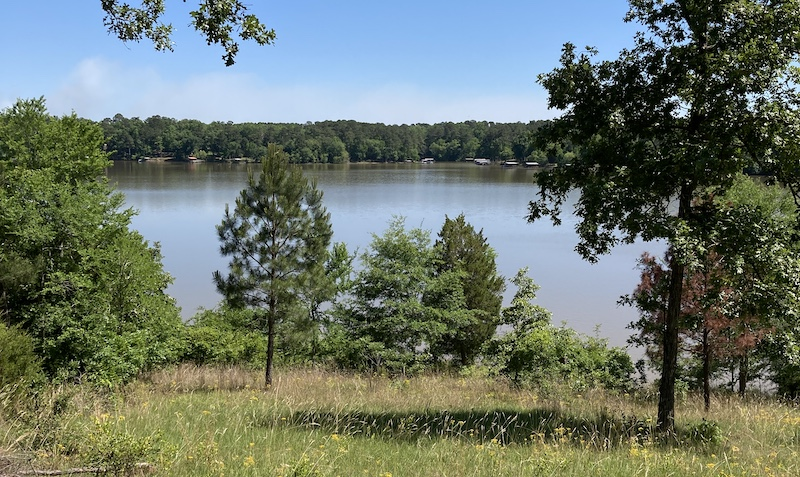
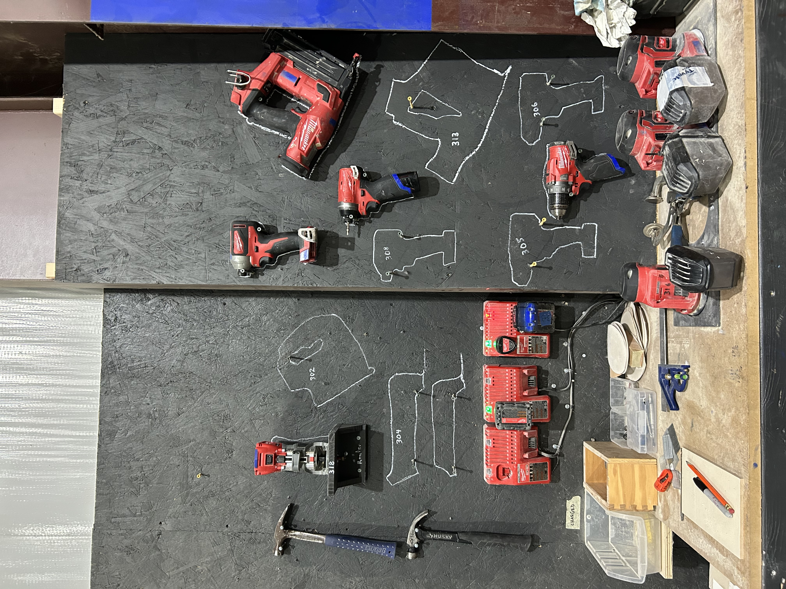
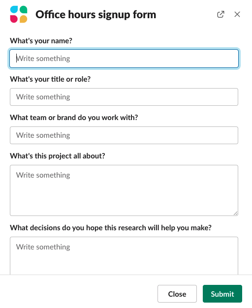

*A note and a request: this post is part of a larger idea that is still taking shape. If this post makes you feel a certain way, or if you have feedback, [please let me know](../contact)!*

***

One of my favorite ways to spend a weekend is to rent a small cabin in the mountains or near a lake, usually in a state park. There I brew a pot of strong coffee, take in the views, and read or write for hours on end with breaks here and there to take a family walk and eat meals together.

Last year, my family bought a small parcel of undeveloped lakefront land near a state park we love. The land is in a remote spot one hour and ten minutes by car from where we live—close enough that we can go anytime, but far enough that the surroundings appear different than what we’re used to. We are now developing the land in order to place a small, née tiny, cottage on it.

*A future room with a view.*

Developing land is not for the faint of heart. Our lot is on a steep slope that leads down to the lake, which means we need to grade the land to create a flat spot for our cottage. There are neither water nor sewage lines nearby, so we’re drilling a well and installing a septic system.

The most cost- and time-effective way to construct a house is via modular construction. Modular homes are built in a factory, which means weather delays are not a factor. The materials, tools, and laborers are centralized, which mitigates logistics issues. Because each home follows a template, the manufacturer can order materials in bulk to increase economies of scale. At the end of the construction period, the finished home is delivered to the property and tied into the waiting plumbing and electrical hookups.

## A signal of care

Construction is just one of many ongoing processes within the larger ecosystem of building a home. Securing financing for a home is a process. Land development is a process. Permits are a process. Any interruption in one part of the ecosystem impact the others.

There are plenty of inefficient and nonsensical processes, born of ignorance or malice. Those are not what I’m talking about here. I’m thinking of processes that connote that someone has married time and expertise in service of reaching a desired outcome.  **A thoughtful process is a signal of care.** I picked up on these signals loud and clear recently.

In considering a builder for our project, we wanted to partner with a firm that understood and demystified the overlapping processes at play. The first builder we considered created beautiful—and beautifully crafted—homes. But when we engaged them for our project, the sales manager was slow to reply to emails and phone calls. We found ourselves repeating information we had previously shared with him, or following up in search of information that he had promised.

> How you climb a mountain is more important than reaching the top.
>
> <cite>Yvon Chouinard</cite>

Zooming out, we noticed that the company’s website hadn’t been updated in nearly a year. That the materials and appliances they use for their homes are bought piecemeal and off-the-shelf from a big-box home improvement store, rather than in bulk from a supplier where the cost per unit is lower. Yvon Chouinard, founder of Patagonia, wrote in his memoir that “[how you climb a mountain is more important than reaching the top](https://www.goodreads.com/work/quotes/23218).” Nothing in how this builder works felt intentional—it was all a series of ad hoc decisions en route to the top.

Then we engaged with a second builder who presented an experience altogether different from the first. The second builder, Wind River, had us complete an intake form. The form was a precursor to a phone call, during which time a sales manager presented us with an outline of their end-to-end building process, talked through our specific needs, and provided an estimate of costs.

  

    
    
    
  

    <em>Photos of their immaculate work area courtesy of <a href="https://www.windrivertinyhomes.com/" target="_blank">Wind River</a></em>
  

We visited Wind River’s factory in Chattanooga, Tennessee to get a sense of their models’ suitability for our needs. The homes are built with an impressive attention to detail, which is no surprise: every facet of their building process is intentional. Nowhere was this more evident than on the factory floor, where there is a dedicated space for every tool and every part.  Their homes—and their process of building them—are the result of a thoughtful process. They care about the result and are intentional about how they get there.

## Intentional interactions

I recently started holding user research office hours for my product colleagues. Every other Tuesday, my team is available for an hour to answer questions, review plans, or talk through ideas that don’t come up during other meetings.

I want everyone I work with to benefit from user research—after all, our goal as researchers is to help everyone make informed decisions. The easy thing would be to block time on my calendar, share a Zoom link, and give folks permission to drop in. But easy isn’t always effective.

My constant refrain since I started in my role a few months ago is that I’m **putting infrastructure in place**. You can call this operationalizing or templatizing. I’d prefer to say I’m being intentional—I want to design an experience that makes office hours productive for everyone. To do so, I need to know who plans to attend ahead of time and what’s on their minds so that me and my team come prepared to help.

*The office hours signup form in Slack.*

I didn’t want to put too much friction between potential attendees and office hours—our process needed to be lightweight yet fruitful. So I ended up building a Slack automation in our public user research channel. Anyone is welcome to attend office hours, but to do so they need to reserve a spot by completing a form that asks what they hope to learn, how this information will help, and when they plan to run a study. The form responses are forwarded to my research team, which gives us a chance to come prepared to office hours. The responses are also sent to a spreadsheet, which gives us an office hours topic tracker that we can use to evolve our research training materials and documentation.

## Every experience can be designed

Companies are living ecosystems where people come and go, and tools and workflows change. In this environment, we must examine and evolve not just our work but *how* we work. 

Office hours might work just fine without the signup form, but “might” is doing a lot of heavy lifting in that scenario. By being intentional about the entire office hours experience, we increase the chances that the session is more impactful and leads to better outcomes. This is the promise of user-centered design: that every experience, like making an appointment or building a home, can be made more thoughtful and intentional.

***

**End notes**

* We visited a third builder who works in a manner nearly identical to Wind River, with a clearly defined process that signals expertise and thoughtfulness. The third builder’s home meets the highly specific zoning requirements of the county in which we’re building, and I expect to enjoy an early morning coffee on the lake by September. 🤞🏻
* For further reading on systems and processes, consider Donella Meadows' [Thinking in Systems](https://bookshop.org/p/books/thinking-in-systems-international-bestseller-donella-meadows/8755142?ean=9781603580557). For more on human-centered design writ large, explore Christopher Alexander’s [Timeless Way of Building](https://bookshop.org/p/books/the-timeless-way-of-building-christopher-alexander/11764819?ean=9780195024029). For your inspiration, find your nearest [state park](https://www.americasstateparks.org/find-a-state-park/).
* Thoughts? Feedback? [I'm all ears!](../contact)
