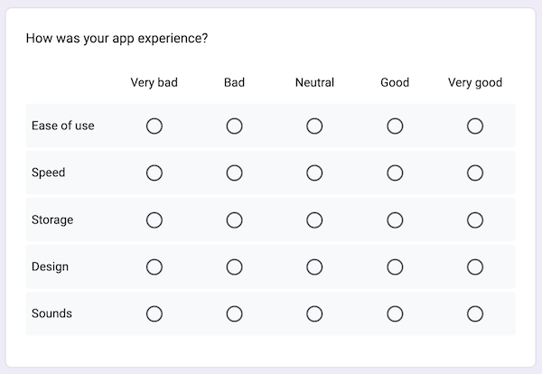

I love surveys. They get a bad rap, sometimes deservedly. But a well-written and thoughtfully designed survey is a powerful research tool. I’ve sent plenty of them, as have the teams I’ve managed. Over time I’ve developed strong opinions about how to build surveys in a way that yields useful information *while prioritizing the user experience*.

Here I’ll share the guidance I typically provide my colleagues when we work on a survey together. I’ve divided this post into four sections:

* Things I want you to know about surveys
* Things I never want you to do with a survey
* Things I always want you to do with a survey
* Things you should read to be great at surveys

To be sure, I am not a survey scientist. Nor am I a statistician. The advice that follows comes from extensive experience, trial and error, and my prioritization of the survey experience for the respondent.

## Things I want you to know about surveys

**Surveys take practice.**
There’s no way around it. Writing crystal clear question and answer combinations that build upon each other in a way that keeps your respondent engaged, *while also yielding valuable insights*, takes some trial and error. Your first few survey attempts will be *terrible*.

**Surveys are useful if you need a signal or a direction.**
A survey alone is no substitute for engaging with users. But to establish the general contours of a problem space, a survey is a good start.

**Surveys are better if you can tailor them to your target audience.**
Phrasing matters. The more familiar you are with the vocabulary of your respondents, the more accurate you can be in how you frame questions and answer choices.

**Surveys are good for finding people to talk to; they’re not a substitute for talking to people.**
A survey is great for sourcing people to talk to. Recruit people based on their answer choices, or to get more detail about their open-ended responses.

**Surveys are a cheat code for team collaboration.**
*Does this phrasing make sense? Did we miss any possible responses? Can you go through the flow once more and test the logic?* Surveys are a great forcing mechanism for teams to work together. You absolutely need multiple sets of eyes on a survey, especially as you write, design, and test it.

## Things I never want you to do with a survey

**Never ask for information you already have.**
If you send a survey to a customer for whom you have data, don’t ask them to provide you *with that same data*. That’s just a waste of time for everyone.

**Never ask for information you won’t use.**
You will be tempted to include questions that “might be nice to know the answer to.” Fight that temptation. Unless you’re incentivizing your respondents for their time, your extra questions are taking advantage of their goodwill.

**Never *require* questions that you don’t absolutely need.**
Actually, never require questions, period. Unless you’re incentivizing your respondents for their time, be grateful someone is voluntarily providing you with *any* survey responses.

**Never, ever *require* someone to provide a comment or an open-ended response.**
The previous guidance is doubly applicable here. You’re lucky your respondent is making selections and filling in checkboxes. Unless you’re incentivizing your respondents for their time, don’t you dare tell them they are “required” to write sentences for you. This isn’t school, and you’re not assigning homework.

*What exactly am I being asked?*

**Never use ambiguous phrasing.**
This is where practice comes into play. Make sure that what you ask and what your respondents *think* you’re asking are the same. For example, look at the image above of a one question micro-survey I received in my Gmail app: “Is this useful?”

Is *what* useful, exactly? If the question is whether these specific ads are relevant to me, then no. If the question is whether it’s generally useful to see ads in my inbox, also no. The ambiguous phrasing that made me consider at least two possible interpretations of the question guarantees that Google will not get useful data. Be specific in what you ask.

**Never be lengthy.**
If you’re not compensating your respondents, at least give them the gift of brevity.

**Never use noisy scales when you need specifics.**
On a 10-point satisfaction scale, what’s the difference between a 6 and 7? Instead, ask “Are you satisfied?” followed by Yes or No, or use a tighter scale, like a scale from 1 to 3 or from 1 to 5. (Come to think of it, [follow Jared Spool’s advice](https://www.uie.com/wp-assets/transcripts/is_design_metrically_opposed.html) and use a better word than satisfied.)

The exception here is if you’re tracking survey responses over time, in which case the wider scale allows you to see historical changes. [Further reading from me on survey scales](https://gregg.io/survey-scales).

**Never ask people to predict their future behavior.**
You know we can’t see the future, right? Please don’t ask your respondents if they’re *likely* to recommend or purchase something. Instead, ask them if they *did* recommend or purchase something. [Further reading from me on asking about the future](https://gregg.io/stop-pretending).

*Why would anyone want to complete this?*

**Never use matrix questions.**
Matrix questions, like the example provided above, require time and concentration. They *look* like a lot of work—so much so that respondents might drop out of your survey at the sight of one, especially on mobile. Avoid these if you can. If you can’t, remember to make it optional.

**Never ask a question in a way that you won’t be able to analyze.**
Asking an open-ended question of 20 respondents: easy to analyze. Asking that same question of 12,000 respondents: not so much. That’s not to say it can’t be done, but make sure you have the staff or decent AI to do it (not to mention an agreed-upon taxonomy for coding answers!).

## Things I always want you to do with a survey

**Always explain the rationale and value of the survey right off the bat.**
Don’t just expect people to know why they should give you information. Tell them why you’re asking for input, how you’ll use it, *and how you’re protecting their privacy*.

**Always write like a human.**
Think of a survey as an asynchronous conversation. Phrase your questions clearly and conversationally.

**Always allow for edge cases.**
Your answer choices might suit 99% of your respondents, but you still want to leave room for the unexpected. Whenever possible, add “Something else (please specify)”  or “Other” answer choices. However: **never, ever, ever use “Other” as a choice for a question related to gender or sexuality.** See below.

**Always provide inclusive choices.**
While it’s truly none of your business, if you must ask about gender identity, sex, race, ethnicity, or other demographics, do the work of providing inclusive answer choices. [This post from Mei Ke](https://uxdesign.cc/an-updated-lgbtq-friendly-survey-template-235b99aee0fe) is a great primer for building LGBTQ+ -friendly surveys.

**Always include a catch-all question.**  
This is the exception to asking unnecessary questions. If a respondent spends time answering all your questions, give them a chance to share what’s top of mind for them by concluding with *one simple question*: “Anything else you want to share with us?” More often than not, this is where your mind will be blown.

## Things you should read to be great at surveys

When it comes to surveys, I find these resources to be the gold standard:

**Principles of effective survey design.**
Annie Steel’s [Principles of effective survey design](https://stripe.com/guides/atlas/survey-design-principles) is so thorough, clear, and educational, yet so concise. It’s annoying how great it is.

**Surveys That Work.**
For a brief time the link above was the only survey resource I endorsed without hesitation. And then Caroline Jarrett released [Surveys That Work: A Practical Guide for Designing and Running Better Surveys](https://rosenfeldmedia.com/books/surveys-that-work/) in 2021 and the world had two amazing survey resources.
