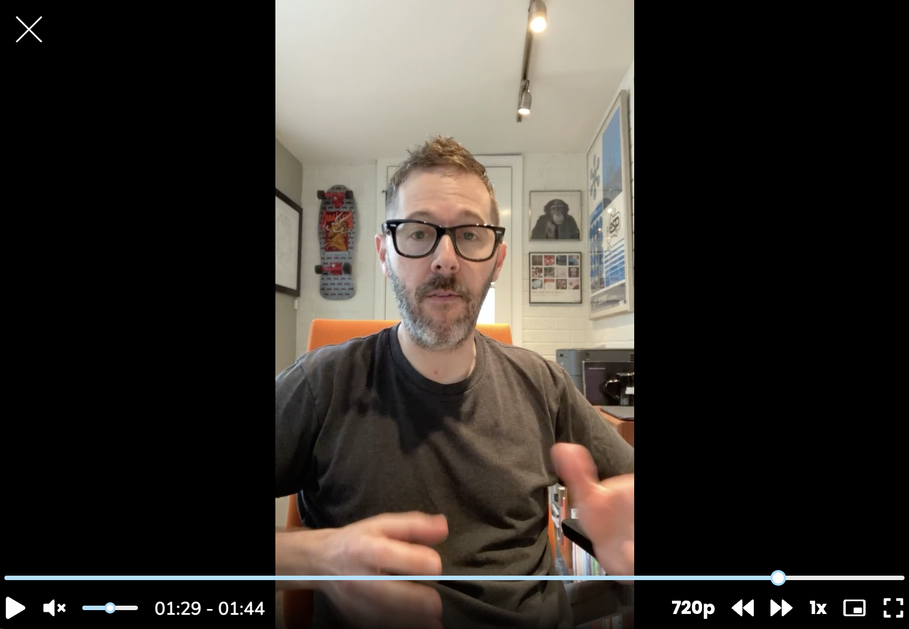

Over on Learners, I answered the question, “What’s your advice for designers transitioning into a research role?”

*Me talking about moving from design to research (screenshot only—click [here](https://joinlearners.com/thought/whats-your-most-important-piece-of-advice-for-designers-transitioning-into-a-research-role_) to watch!)*

I was a designer and design professor before I transitioned into UX research. While there is *plenty* to learn to successfully make the transition from design to research, one thing that worked for me was to **think of every facet of the research process as a discrete experience to design**. Here’s how you might do this:

* In creating a research plan, your goal is to design the combination of methods and participants that will yield the right knowledge.
* In writing a discussion guide, you can design, test, and finalize a question flow that will yield informative answers.
* In planning a usability test, you have to design the right mix of tasks and questions to yield conclusive findings.
* You can design how your colleagues will *experience* your research; what will your workshops, research updates, or presentations be like?

To be sure, each one of the tasks I mentioned above is a lot to think about. But by breaking the research process into a series of smaller experiences to design for our participants and colleagues, we're able to leverage our design training in service of our research goals.

So in short: think of your research process as yet another experience to design.

[You can watch the video version of this post here](https://joinlearners.com/thought/whats-your-most-important-piece-of-advice-for-designers-transitioning-into-a-research-role_).
