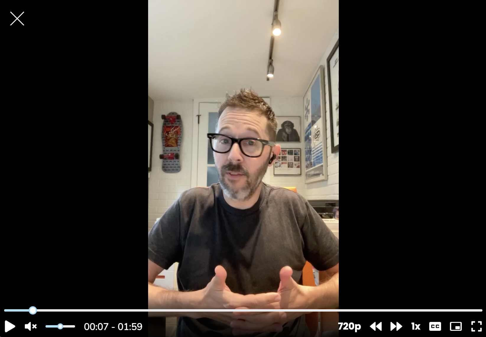

## Optimize for more decisions, not infinite research

For Learners, I answered the question, “Can research ever come to an end?”

*Me talking about when research comes to an end (screenshot only)*

Research never ends. But research *projects* have to end.

Another way to say this is that you *could* keep researching a topic until the end of time—there are always new directions you can take a study. Every new user and everything they do is yet another data point for you to potentially examine. You can add every possible competitor to your competitive analysis, and analyze every new transaction for emerging trends.

But this is neither a good use of your time nor talent. Your org hired you to help make design and product decisions that support the business goals of the organization. A research project that doesn’t end has an opportunity cost of other research projects that you aren’t doing.

(Another reason to not research forever: you will likely reach theoretical saturation if you keep researching the same topic long enough. Theoretical saturation is the point at which further research will yield no new insights. In other words, you’ve covered it and it’s time to move on.)

So research doesn’t have to end, but it should for the sake of the business and to open opportunities to support other product and design decisions. When you scope a project, **include a clear stopping point**. Stopping points might be based on the date your partners need to make a decision (“We need to present findings at the end of the next sprint”), or upon successfully answering the key research questions you and your cross-functional partners agreed upon at a kickoff (“We’re scoping this project to these three research questions. Anything else is nice to know but not critical”).

So be curious. Be rigorous. But keep in mind that your research is in support of making decisions. Scope your projects to optimize for more decisions, not infinite research.
