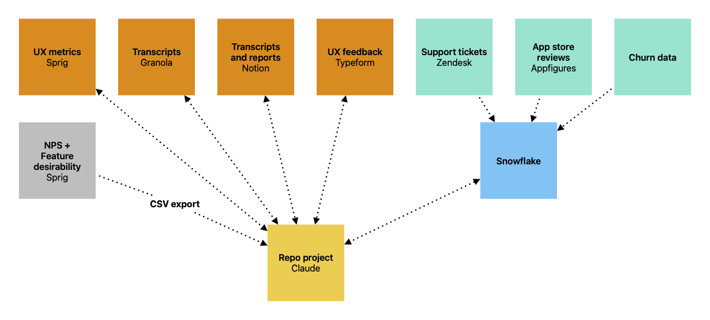

Way back in 2017, I wrote about [the challenge of evangelizing user research](https://gregg.io/ambient)—both the practice and the findings:
> I need my work to take multiple shapes and appear in multiple outlets. By peppering my work everywhere, I try to create an **ambient awareness of research** across our product team

My strongest recommendation then—and now—is to put research where people are *already* working. Not in a purpose-built research tool that only the research team has (or wants) access to. Not in a deck that no one will ever see. Not in a custom dashboard in a workspace no one will ever stumble upon. What I said back then was if your org uses Google Workspace, store your work in Sheets, Docs, Slides, and Sites so folks might luck into finding it in their workspace search results. If your org uses Notion and Slack, use Notion and Slack to contain and communicate research.

This was a hard-earned lesson from my time on the Mailchimp UX team. There [we used Evernote as our research repo](https://alistapart.com/article/connected-ux/)—we could forward interesting customer emails, capture raw interview notes, draft reports, and pull in daily app data via CRON jobs. For a brief period, Evernote gave everyone at Mailchimp a single source of truth. Eventually, as Mailchimp adopted new enterprise workplace tools and platforms, Evernote became an afterthought. Logins to Evernote decreased, the CRON jobs quietly failed, and eventually we abandoned Evernote entirely. The repo was too far removed from normal business operations.

## The dream of a single source of truth
The territory of user research is vast. The projects I worked on recently ranged from establishing and monitoring core UX metrics to usability studies and concept tests for teams to deep strategic initiatives for executives. On any given day I reviewed user churn data, support tickets, UX feedback, site analytics, and UX metrics before designing a study, engaging with users, sensemaking, documenting, or sharing. **I enjoy every part of what goes into those activities**—especially designing a study and engaging with users. In fact, those are the facets of my work that, were they to disappear, would diminsh the appeal of the work entirely. 

When my previous org chose Claude as its primary AI platform, with seats provided to all and a mandate to become AI fluent, I had no interest in offloading research tasks to Claude. **But what if an entire org, working together in a platform with the ability to connect to all relevant data sources, presented an opportunity?**

If that’s where work takes place, and that’s where data flows, that’s a good spot for a repository. **So I used Claude to build the research repo I always wanted.**

## Maps and flowcharts
My first step was to document the tools I was managing or using for research:
- UX metrics (search quality, recommendation relevance) in Sprig
- NPS and feature desirability in Sprig
- Customer churn data from a homegrown exit survey in Snowflake
- App store reviews (iOS and Google Play) from Appfigures
- UX feedback and suggestions in Typeform
- User interview transcripts in Granola and Notion
- Reports in Notion
- Customer support tickets in Zendesk

For each of the above, I also explored connection options: does the platform or product support an MCP server, have an API, or allow scheduled exports?

On the advice of a colleague, I then wrote a detailed description of what I was after in a Claude project: a living, governed database of credible primary research sources—queryable with natural language, accessible to anyone in my organization, protective of PII, with no friction for research customers (meaning no special permissions, no seat licenses, no app installs).

I spent a few days experimenting with different systems designs, noodling on where the data should live (Claude project, Snowflake, locally) and when an API call made sense vs. when an imported CSV might be better. I also worked with my engineering and data science colleagues to understand what could be pulled into Snowflake on a regular basis (a CRON job) instead of relying on ad hoc API calls or an overworked MCP server. What I landed on was:
- Snowflake ingests churn data, Zendesk tickets, and app store reviews from Appfigures weekly
- Claude queries Snowflake for the data above as needed
- Claude queries Typeform for UX feedback as needed
- Claude queries Sprig for UX metrics as needed
- Claude queries Notion and Granola for interviews and reports as needed
- I manually upload data exports for large NPS and feature desirability surveys to Claude from Sprig at the conclusion of each study

TL;DR: Claude either (1) queries Snowflake, Sprig, Typeform, Granola, or Notion or (2) has the data stored in the project already.

**Note that *nothing* gets added to the repo that is not blessed by research (me). For the repo to be credible and reliable, no garbage may enter.**

## House rules
I named the research repo project in Claude *Tapestry*. With Tapestry established as the home for research, I needed to post house rules… for Claude. Without rules the repo and its output become entropic, with small samples treated as conclusive and tightly targeted studies treated as generally representative. While the actual Tapestry project skill includes org-specific language, connector details, and source routing, these are the integrity rules I included:

### Non-negotiable integrity rules
Every answer that presents a finding MUST include:
1. **Sample size.** State n for every quantitative claim. Under n=30, label the finding "very small sample—directional at best." Between 30–100, label it "small sample." Never present a subgroup breakdown without its n.
2. **Freshness.** Anything older than 12 months from today's date is **not fresh**—flag it prominently BEFORE presenting the finding, not as a footnote. For live sources, check the most recent record date as part of the query. For file-based sources, infer coverage from the filename and manifest below.
3. **Representativeness.** Each source has known bias—state it when relevant (see per-source caveats). Sprig intercepts reach engaged, logged-in users; the Typeform survey is a voluntary settings-page link that skews toward motivated respondents; cancellation surveys reach only churned members; support tickets skew toward problems; interview participants were recruited, not sampled.
4. **Negative results are valid signals.** If a topic doesn't surface in a source, say so—absence of evidence in interviews or surveys is meaningful for calibrating how widespread an issue is. Never pad a thin result to make it look substantial.
5. **Directional framing.** Don't perform statistical significance testing unless asked. Frame findings as directional. No prior-period comparisons unless explicitly requested.
6. **Style.** Organize syntheses by theme (not by participant), support themes with verbatim quotes, write for a mixed audience of executives and non-data colleagues.

## Research to be done
As a research team of one, I was not the customer for this repo—I already knew where all the research bodies were buried. The repo needed to accommodate a handful of scenarios for those who are not researchers, like:
- When I have a question about our users, I want to identify existing research so I can avoid requesting or conducting duplicative work.
- When I hear feedback from a user, I want to identify whether others have raised something similar so I can appropriately weigh the frequency and severity of the request.
- When I want to gather a snapshot of part or all of the user experience, I want to leverage multiple sources to avoid a fragmented view.
- When my repo query comes up short or identifies a gap, I want a concrete next step so I know how I might proceed. *Note that this last skill is the one I am most conflicted by. I love working with my colleagues to shape and size a study, but I can’t be a blocker to critical questions or projects. This scenario can point in a direction that might be better handled by a data scientist (multivariate testing), or might be something a designer can easily handle without me (usability study).* 

### Four core skills 
I reviewed a bunch of articles, blog posts, guides, and skills shared by research practitioners and research platforms to identify those that fit my needs. I also reviewed common engineering skills to include best practices when it comes to workflows and quality gates. These are the skills I landed on as a starting point—all of them are available for your use.
- [Research synthesis](https://drive.google.com/file/d/1_fqJdsZQaQugdVMnOf_xlt4ribuTTb-C/view?usp=drive_link): Synthesize qualitative and mixed-source research—interview notes, open-ended survey responses, support tickets, usability observations, cancellation feedback—into evidence-backed themes, decision-ready insights, and optional downstream framings (jobs-to-be-done, journey maps, proto-personas). This skill pulls from dscout's excellent *[How to Build Better Products with AI-Supported Research](https://www.dscout.com/people-nerds/ai-frameworks-prompts-optimize-research)* (2025), Alan Klement’s [job stories](https://www.intercom.com/blog/accidentally-invented-job-stories/), and Jeff Gothelf’s [proto-personas](https://jeffgothelf.com/blog/using-personas-for-executive-alignment/).
- [Verified survey analysis](https://drive.google.com/file/d/1OPKdMaK7b1npR7rM09xUd4au30ziYuLC/view?usp=drive_link): Run verified, defensible quantitative analysis on survey data—cross-tabs, open-text theming, MaxDiff, conjoint, and Gabor-Granger pricing—with built-in data validation, sample-size checks, and independent recomputation of every reported number. The method-specific procedures (cross-tab, themed cross-tab, MaxDiff, conjoint, Gabor-Granger) were built directly on [Sprig's (fantastic) published guides](https://sprig.com/guides) for running each analysis with Claude.
- [Research communication](https://drive.google.com/file/d/1FA0N-61evXo0ebaoI1IyWqdEn3X5PirY/view?usp=drive_link): Turn synthesized research findings into stakeholder-ready deliverables—readout narratives, executive summaries, decision memos, and action items—with a stakeholder-pushback simulation before anything ships and strict fidelity to the evidence and confidence levels of the underlying findings. This skill also pulls from dscout's *[How to Build Better Products with AI-Supported Research](https://www.dscout.com/people-nerds/ai-frameworks-prompts-optimize-research)* (2025).
- [Research scoping](https://drive.google.com/file/d/186LCrsCME07wXDHuTm_e882mTbsEDb3D/view?usp=drive_link): Turn a vague research ask into a decision-ready study—or into the conclusion that no new study is needed. Produces a one-page research brief (decision, sharpened research questions, 2–3 method options with tradeoffs, participants, timeline, risks) plus first-pass instruments (interview guide, screener, usability tasks, or survey draft). *Again, this one makes me feel a certain way.* This skill pulls from dscout's *[How to Build Better Products with AI-Supported Research](https://www.dscout.com/people-nerds/ai-frameworks-prompts-optimize-research)* (2025), which includes Nikki Anderson’s TEDW interview mnemonic.

Each skill's structural format (numbered process, anti-rationalization table, red flags, verification checklist) follows the pattern documented in Addy Osmani's open-source [agent-skills project](https://github.com/addyosmani/agent-skills).

## End hits
- I am not an engineer, but I am comfortable working in the terminal and in code (exhibit A: my Jekyll site). **I was able to put most of this project together myself** with Claude, code, the terminal, and a bunch of API experiments. Claude was provided by my org, and I did not spend any of my research budget on this project. 
- I did need help moving data into Snowflake. For that, one of my data scientist colleagues dedicated a few days to build the pipelines and create recurring tasks for updates.
- Pro-tip: One of my directions for Claude was to turn on connectors to all data sources as part of the first-run experience for new users. This way my colleagues would go ahead and get read-only access to Sprig, Typeform, Snowflake, etc. as part of the onboarding process.
- I said above that nothing gets added to the repo that is not blessed by research. This doesn’t mean a colleague can’t upload discovery call notes or an ad hoc survey CSV to their instance of the project and leverage the repo and skills therein; it just means that the ad hoc study—until proven credible—is not added to the official corpus of user research. This strict quality control keeps the repo credible.
- Finally, I previously wrote about the challenge of maintaining a career that centers human connection at a time when [the pressure to embrace artificial intelligence has never been stronger](https://gregg.io/the-only-winning-move). Where I landed in that post was that the unceasing pressure to conform—from employers, vendors, and industry leaders—was not reason enough to change. This is easy to say from the privileged position of gainful employment, and I acknowledge it's a much tougher case to make when AI fluency mandates and mass layoffs have removed leverage from both employees and job applicants. The most constructive feedback I received from my post was “you’re a researcher—treat this as a research project,” which is how we ended up here. I remain skeptical, but as the Toyota Production System advises: genchi genbutsu.
